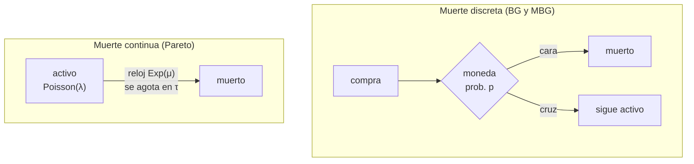

# Modelos BTYD con abandono

> [!abstract] ¿Qué resuelve?
> La [[NBD - Poisson, Gamma y Binomial Negativa|NBD]] supone que el cliente compra para siempre. En retail eso es falso: los clientes se van sin avisar y sin que nadie lo registre. BTYD (*Buy 'Til You Die*) añade un segundo proceso —el abandono— que **nunca se observa**.
>
> Como la muerte es invisible, la verosimilitud no puede elegir una historia: **suma las dos que son compatibles con lo observado**, *"sigue activo"* y *"abandonó tras su última compra"*. El cociente entre la primera y el total es la probabilidad de seguir vivo.
>
> De ahí salen las dos cantidades que el negocio necesita: $P(\text{vivo})$ para medir fuga, y $E[Y(t)]$ —transacciones futuras esperadas— para calcular CLV.

Nota teórica. Los ejemplos didácticos usan valores genéricos; los que citan CDNOW o *grocery* son de los papers. Los hallazgos sobre nuestra base están en [[Descubrimientos - ecommerce metro]], y el código que corre en producción, en [[Diagnostico del modelo en produccion]].

> [!info] Fuentes
> - **Fader, P., Hardie, B. & Lee, K. (2005)** — *"Counting Your Customers" the Easy Way: An Alternative to the Pareto/NBD Model*, Marketing Science 24(2), 275–284. El paper original del BG/NBD. Se cita como **FHL05**.
> - **Fader, P., Hardie, B. & Lee, K. (2008)** — *Computing P(alive) Using the BG/NBD Model*, nota técnica 021. Deriva $P(\text{vivo})$, que **el paper original no incluye**, y presenta las dos variantes que arreglan el caso $x=0$. Se cita como **FHL08**.
> - **Fader, P., Hardie, B. & Lee, K. (2005)** — *Implementing the BG/NBD Model for Customer Base Analysis in Excel*, nota técnica 004. La descomposición $A_1A_2(A_3+A_4)$ y la receta numérica. Se cita como **nota 004**.
> - **Platzer, M.** — *BTYDplus: Customer Base Analysis with BTYD Models* (vignette del paquete de R). Comparativa empírica entre Pareto/NBD, BG/NBD, MBG/NBD y las variantes CNBD-k.
> - **Schmittlein, D., Morrison, D. & Colombo, R. (1987)** — el Pareto/NBD original, citado a través de FHL05 como **SMC**.
>
> Las distribuciones que se usan como ladrillos (Poisson, Gamma, Geométrica, Beta, Exponencial) están en [[Teoría Distribuciones Base]].

---

## Capa 1 — Intuición

Un cliente lleva seis meses sin comprar. ¿Está **muerto** o simplemente es **lento**?

Esa es toda la pregunta. Y la respuesta no depende del silencio en abstracto, sino del **ritmo previo de ese cliente**:

- Para quien compraba cada semana, seis meses de silencio es una anomalía flagrante.
- Para quien compraba dos veces al año, seis meses es su rutina.

El modelo formaliza esa intuición con **dos relojes que corren a la vez y que nadie ve**:

1. **El reloj de compra.** Mientras está vivo, el cliente compra según un Poisson de tasa $\lambda$ — a un ritmo constante pero irregular.
2. **El reloj de muerte.** En algún momento deja de ser cliente, para siempre, y nadie lo registra.

Solo se observa el rastro que dejan juntos: unas fechas de compra y luego **silencio**. El silencio es ambiguo, y esa ambigüedad es exactamente lo que el modelo cuantifica.

> [!important] Los tres datos que resumen a un cliente
> No hacen falta las fechas de todas las compras. Todo lo que el modelo necesita cabe en tres números:
>
> | Símbolo | Nombre | Significado |
> |---|---|---|
> | $x$ | frecuencia | número de **recompras** (compras totales menos la primera) |
> | $t_x$ | recencia | tiempo entre la primera y la **última** compra |
> | $T$ | exposición | tiempo entre la primera compra y la fecha de corte |
>
> Que estos tres basten no es una simplificación cómoda: es un resultado del modelo. En §3.2 se ve por qué las fechas intermedias se cancelan solas.

> [!warning] Por qué $x$ excluye la primera compra
> La primera compra es el **nacimiento** del cliente: define el origen de su reloj y es la razón por la que aparece en la base. Contarla introduciría sesgo de selección —todos tendrían al menos 1 por construcción— y ese 1 no informaría de nada.
>
> Con $x=$ recompras, el valor $0$ significa algo real y observable: *"compró una vez y no volvió"*.
>
> Este *off-by-one* es el error de implementación más común: un cliente con 5 visitas tiene $x = 4$.

### La diferencia entre los tres modelos, en una frase

Los tres comparten el reloj de compra y difieren **solo** en cómo modelan la muerte:

| Modelo | Cuándo puede morir | Imagen mental |
|---|---|---|
| **BG/NBD** | tras cada **recompra** | tras cobrar, lanza una moneda: cara, se va |
| **MBG/NBD** | tras cada compra, **incluida la primera** | la misma moneda, pero también la lanza al nacer |
| **Pareto/NBD** | en **cualquier instante** | lleva encima una mecha encendida de duración aleatoria |

> [!success] La propiedad que separa de verdad a BG/NBD de Pareto/NBD
> La descripción "discreto vs. continuo" suena a tecnicismo. La consecuencia real es otra, y es profunda:
>
> En **BG/NBD**, la moneda se lanza *después de cada compra*. Quien compra el doble de rápido, lanza la moneda el doble de veces, y por tanto **muere el doble de rápido en tiempo de calendario**. La muerte queda atada al ritmo de compra.
>
> En **Pareto/NBD**, la mecha arde sola, al margen de que el cliente compre o no. Un cliente puede morir sin haber vuelto nunca.
>
> Se demuestra en §3.3, y de ahí sale otra propiedad muy limpia: en BG/NBD, $\lambda$ controla **a qué velocidad** un cliente gasta su vida, y $p$ controla **cuántas compras contiene** esa vida.

---

## Capa 2 — Ejemplo a mano

Antes de la fórmula general, tres cálculos completos con números.

> [!example] Ejemplo 2.1 — $P(\text{vivo})$ paso a paso
> Parámetros del modelo (BG/NBD): $r = 0.5$, $\alpha = 100$, $a = 1$, $b = 2$.
> Cliente: $x = 5$, $t_x = 200$, $T = 600$. Es decir, **cinco recompras, la última el día 200, y luego 400 días de silencio.**
>
> La fórmula es $P(\text{vivo}) = \dfrac{1}{1 + \frac{a}{b+x-1}\left(\frac{\alpha+T}{\alpha+t_x}\right)^{r+x}}$ y se arma en tres piezas:
>
> **Paso 1 — el prior de abandono, atenuado por la fidelidad ya demostrada:**
> $$\frac{a}{b+x-1} = \frac{1}{2+5-1} = \frac{1}{6} = 0.16667$$
> Cuantas más recompras acumula el cliente, más pequeño es este factor: las recompras son evidencia de que su moneda cae poco en "cara".
>
> **Paso 2 — cuánto silencio hay:**
> $$\frac{\alpha+T}{\alpha+t_x} = \frac{100+600}{100+200} = \frac{700}{300} = 2.3333$$
> Vale exactamente $1$ si el cliente compró justo en la fecha de corte ($t_x = T$), y crece con el silencio.
>
> **Paso 3 — cuánto pesa ese silencio (aquí está el efecto dominante):**
> $$2.3333^{\,r+x} = 2.3333^{\,5.5} = 105.65$$
> El exponente $r+x$ es lo que convierte un silencio moderado en evidencia contundente.
>
> **Paso 4 — el resultado:**
> $$P(\text{vivo}) = \frac{1}{1 + 0.16667 \times 105.65} = \frac{1}{18.61} = \mathbf{0.0537}$$
>
> Con la última compra reciente ($t_x = 580$ en vez de 200), el mismo cliente daría $P(\text{vivo}) = 0.8365$.

> [!example] Ejemplo 2.2 — el mismo silencio, distinta frecuencia
> Mismos parámetros, mismo silencio de 400 días ($t_x = 200$, $T = 600$), variando solo $x$:
>
> | $x$ | $\dfrac{a}{b+x-1}$ | $2.3333^{\,r+x}$ | $P(\text{vivo})$ |
> |---|---|---|---|
> | 1 | 0.5000 | 3.56 | **0.3594** |
> | 5 | 0.1667 | 105.65 | **0.0537** |
> | 20 | 0.0476 | $3.5\times10^{7}$ | **0.0000** |
>
> Los dos factores tiran en direcciones opuestas —más recompras bajan el prior de abandono, pero suben el exponente— y **gana el exponente, por goleada**.

> [!success] Interpretación: es lo que se pedía en la Capa 1
> Con idéntico silencio, el cliente de 20 recompras tiene probabilidad de estar vivo prácticamente nula, y el de 1 recompra la tiene en 0.36.
>
> Para quien compraba cada mes, 400 días de silencio es **incompatible** con seguir vivo. Para quien compraba una vez al año, es su ritmo normal. El modelo llega solo a esa conclusión: nadie se la programó.

> [!example] Ejemplo 2.3 — un cliente real, y la cantidad que sirve para CLV
> De la nota 004, cliente `0001` del dataset CDNOW (2 357 clientes, cohorte del primer trimestre de 1997). Parámetros ajustados sobre esa base: $r = 0.243$, $\alpha = 4.414$, $a = 0.793$, $b = 2.426$ (unidad de tiempo: semanas).
>
> El cliente hizo $x = 2$ recompras, la última en la semana $t_x = 30.43$, con exposición $T = 38.86$. Pregunta del negocio: **¿cuántas compras hará en las próximas 39 semanas?**
>
> Eso no lo responde $P(\text{vivo})$, sino la esperanza condicional $E[Y(t) \mid x, t_x, T]$ de §3.8:
> $$E[Y(39) \mid x{=}2,\; t_x{=}30.43,\; T{=}38.86] = 1.226$$
>
> Es decir: **se esperan 1.2 transacciones de este cliente en las siguientes 39 semanas**. Multiplicado por su margen medio por transacción, eso ya es CLV.

---

## Capa 3 — Formalización

### 3.1 · Los cinco supuestos

FHL05 construye el modelo sobre cinco supuestos explícitos. Los dos primeros son idénticos a los del Pareto/NBD, y los tres últimos son los que cambian.

> [!note] Definición 3.1 — supuestos del BG/NBD
> **(i)** Mientras está activo, el cliente compra según un **proceso de Poisson** de tasa $\lambda$. Equivale a decir que el tiempo entre compras es Exponencial:
> $$f(t_j \mid t_{j-1};\lambda) = \lambda e^{-\lambda(t_j - t_{j-1})}, \qquad t_j > t_{j-1} \ge 0$$
>
> **(ii)** La **heterogeneidad** de $\lambda$ entre clientes sigue una Gamma:
> $$f(\lambda \mid r,\alpha) = \frac{\alpha^{r}\lambda^{r-1}e^{-\lambda\alpha}}{\Gamma(r)}, \qquad \lambda > 0$$
>
> **(iii)** **Después de cada transacción**, el cliente se vuelve inactivo con probabilidad $p$. El número de transacciones hasta abandonar es Geométrica desplazada:
> $$P(\text{inactivo justo tras la } j\text{-ésima transacción}) = p(1-p)^{j-1}, \qquad j = 1,2,3,\dots$$
>
> **(iv)** La heterogeneidad de $p$ entre clientes sigue una **Beta**:
> $$f(p \mid a,b) = \frac{p^{a-1}(1-p)^{b-1}}{B(a,b)}, \qquad 0 \le p \le 1$$
>
> **(v)** $\lambda$ y $p$ varían de forma **independiente** entre clientes.
>
> **Donde:**
> - $\lambda$ — tasa individual de compra, en compras por unidad de tiempo. No se observa
> - $p$ — probabilidad individual de abandonar tras una compra. No se observa
> - $r$ — parámetro de forma de la Gamma. Controla cuán dispersos están los ritmos entre clientes: $r$ pequeño = población muy heterogénea
> - $\alpha$ — parámetro de escala de la Gamma. La media de $\lambda$ es $r/\alpha$
> - $a$, $b$ — parámetros de la Beta. La media de $p$ es $a/(a+b)$
> - $B(a,b)$ — función Beta, $B(a,b) = \Gamma(a)\Gamma(b)/\Gamma(a+b)$
> - $\Gamma(\cdot)$ — función Gamma, la extensión continua del factorial
>
> Los cuatro parámetros del modelo son **$(r,\alpha,a,b)$**. Son de población, no de cliente: se estiman una vez sobre toda la base.

> [!important] Proposición 3.2 — cómo leer $a$ y $b$
> $$E[p] = \frac{a}{a+b}$$
>
> Pero la media puede no representar a nadie, igual que pasa con la Gamma:
>
> - $a$ empuja hacia clientes **volubles**; $b$ hacia clientes **fieles**
> - $a<1$ y $b>1$: densidad en forma de **"J" decreciente** — mayoría fiel, minoría muy volátil
> - $a<1$ y $b<1$: densidad en **"U"** — población polarizada en los dos extremos
>
> Los parámetros de CDNOW ($a = 0.793$, $b = 2.426$) son un caso de "J": $E[p] = 0.25$, pero con casi toda la masa concentrada en clientes de abandono bajo y una cola pequeña de muy volátiles.

> [!example] Ejemplo 3.3 — leyendo una Beta
> Con $a=1$, $b=2$: $E[p] = 1/3$.
>
> | percentil | 25 | 50 | 75 | 90 |
> |---|---|---|---|---|
> | $p$ | 0.134 | 0.293 | 0.500 | 0.684 |
>
> La mediana (0.29) queda por debajo de la media (0.33): el cliente típico abandona algo menos de lo que sugiere el promedio.

---

### 3.2 · La verosimilitud individual, transacción por transacción

Esta es la parte que conviene entender de verdad, porque de aquí sale todo lo demás. La construcción de FHL05 es un producto de eslabones, uno por transacción.

Un cliente hizo $x$ transacciones en $(0,T]$, en los instantes $t_1, t_2, \dots, t_x$:

```
0 ────×────×────────×──────────────── T
      t₁   t₂       tₓ      silencio
```

> [!note] Construcción 3.4 — los eslabones
> Condicionando en $\lambda$ y $p$ (por ahora tratados como conocidos):
>
> - **La primera transacción en $t_1$** aporta la densidad exponencial estándar: $\lambda e^{-\lambda t_1}$
> - **La segunda en $t_2$** exige que el cliente **siguiera vivo** tras la primera, y luego esperara: $(1-p)\,\lambda e^{-\lambda(t_2-t_1)}$
> - … y así sucesivamente hasta la $x$-ésima: $(1-p)\,\lambda e^{-\lambda(t_x - t_{x-1})}$
> - **El silencio final en $(t_x, T]$** es donde aparece la ambigüedad. Hay **dos maneras** de no comprar en ese tramo:
>   $$\underbrace{p}_{\text{murió en } t_x} \;+\; \underbrace{(1-p)\,e^{-\lambda(T-t_x)}}_{\text{sigue vivo pero no compró}}$$
>
> Multiplicando todo:
> $$L(\lambda,p \mid t_1,\dots,t_x,T) = \lambda e^{-\lambda t_1}\cdot(1-p)\lambda e^{-\lambda(t_2-t_1)}\cdots(1-p)\lambda e^{-\lambda(t_x-t_{x-1})}\cdot\left[p + (1-p)e^{-\lambda(T-t_x)}\right]$$
>
> Los exponentes se telescopian —$t_1 + (t_2-t_1) + \dots + (t_x - t_{x-1}) = t_x$— y queda:
> $$\boxed{\;L(\lambda,p \mid x,t_x,T) = \underbrace{(1-p)^{x}\lambda^{x}e^{-\lambda T}}_{\text{vivo en } T} \;+\; \underbrace{\delta_{x>0}\;p(1-p)^{x-1}\lambda^{x}e^{-\lambda t_x}}_{\text{murió en } t_x}\;}$$
>
> **Donde:**
> - $\delta_{x>0}$ — indicador: vale $1$ si $x>0$, y $0$ si $x=0$
>
> Para un cliente con $x = 0$ (ninguna recompra), la verosimilitud es solo la función de supervivencia exponencial, $e^{-\lambda T}$.

> [!success] Por qué bastan tres números
> Al telescopiar los exponentes, **las fechas intermedias $t_1,\dots,t_{x-1}$ desaparecen**. Solo sobreviven $x$ (cuántas), $t_x$ (la última) y $T$ (hasta cuándo se observó).
>
> Es decir: $(x, t_x, T)$ es un **estadístico suficiente**. No es que se decida ignorar el resto de la información — es que matemáticamente no hay más información que extraer. Esto es lo que permite comprimir millones de tickets en una tabla de tres columnas por cliente sin perder nada.

---

### 3.3 · Una consecuencia inesperada: el abandono depende de $\lambda$

FHL05 deriva, casi de pasada, un resultado que explica la diferencia real con el Pareto/NBD.

> [!important] Proposición 3.5 — la vida útil en BG/NBD es exponencial de tasa $\lambda p$
> La probabilidad de seguir vivo en $t$ se obtiene sumando sobre todas las compras que pudo hacer sin que la moneda cayera en cara:
> $$P(\tau > t \mid \lambda, p) = \sum_{j=0}^{\infty}(1-p)^{j}\,\frac{(\lambda t)^{j}e^{-\lambda t}}{j!} = e^{-\lambda p t}$$
>
> Es decir, la densidad del instante de abandono es
> $$g(\tau \mid \lambda, p) = \lambda p\, e^{-\lambda p \tau}$$
>
> **Donde:**
> - $\tau$ — instante (no observado) en que el cliente abandona
>
> La vida útil **sí** resulta exponencial, como en Pareto/NBD, pero con **tasa $\lambda p$**: atada al ritmo de compra en vez de independiente de él.

> [!success] Qué significa esto
> Quien compra el doble de rápido lanza la moneda el doble de veces y, en tiempo de calendario, **muere el doble de rápido**. En Pareto/NBD, en cambio, la tasa de muerte $\mu$ es independiente de $\lambda$ (supuesto (v) de SMC).
>
> De aquí sale una lectura muy limpia de los dos parámetros individuales:
> $$E[X(\infty) \mid \lambda, p] = \frac{1}{p}$$
> **El total de compras que un cliente hará en toda su vida depende solo de $p$, no de $\lambda$.** $\lambda$ únicamente decide *a qué velocidad* las consume.
>
> Dos clientes con la misma $p$ harán en promedio las mismas compras; el rápido las hará en un año y el lento en cinco.

> [!note] De dónde sale $E[X(t)\mid\lambda,p]$
> Combinando el conteo Poisson con la densidad de abandono de arriba:
> $$E[X(t) \mid \lambda, p] = \lambda t \cdot P(\tau > t) + \int_0^t \lambda\tau\, g(\tau\mid\lambda,p)\,d\tau = \frac{1}{p} - \frac{1}{p}e^{-\lambda p t}$$
> Cuando $t\to\infty$, el segundo término se anula y queda $1/p$, que es exactamente la media de la Geométrica desplazada del supuesto (iii). El modelo es internamente consistente.

---

### 3.4 · De un cliente a la población: la mezcla

Todo lo anterior está condicionado a $\lambda$ y $p$, que **no se observan**. Para un cliente elegido al azar se integra sobre las dos distribuciones mezcladoras — la Gamma de (ii) y la Beta de (iv).

> [!important] Proposición 3.6 — verosimilitud del BG/NBD (FHL05, ec. 6)
> $$L(r,\alpha,a,b \mid x,t_x,T) = \frac{B(a,b+x)}{B(a,b)}\cdot\frac{\Gamma(r+x)\alpha^{r}}{\Gamma(r)(\alpha+T)^{r+x}} \;+\; \delta_{x>0}\,\frac{B(a+1,b+x-1)}{B(a,b)}\cdot\frac{\Gamma(r+x)\alpha^{r}}{\Gamma(r)(\alpha+t_x)^{r+x}}$$
>
> Reagrupando el factor común —así es como se implementa (nota 004)—:
> $$L = A_1 \cdot A_2 \cdot \left(A_3 + \delta_{x>0}A_4\right)$$
> $$A_1 = \frac{\Gamma(r+x)\alpha^{r}}{\Gamma(r)} \qquad A_2 = \frac{\Gamma(a+b)\Gamma(b+x)}{\Gamma(b)\Gamma(a+b+x)}$$
> $$A_3 = \left(\frac{1}{\alpha+T}\right)^{r+x} \qquad A_4 = \left(\frac{a}{b+x-1}\right)\left(\frac{1}{\alpha+t_x}\right)^{r+x}$$
>
> **Donde:**
> - $A_1$ — todo lo que aporta el **proceso de compra** (la mezcla Gamma-Poisson)
> - $A_2$ — todo lo que aporta el **proceso de abandono** (la mezcla Beta-Geométrica)
> - $A_3$ — la rama **"sigue vivo en $T$"**
> - $A_4$ — la rama **"murió justo tras su última compra"**
>
> $A_1$ y $A_2$ son un factor común: no distinguen entre las dos historias. Toda la información sobre si el cliente está vivo o muerto vive en el paréntesis $(A_3 + A_4)$.

---

### 3.5 · $P(\text{vivo})$ sale de Bayes

FHL05 **no publicó** esta fórmula. La derivó tres años después en FHL08, tras la insistencia de quienes usaban el modelo, con esta observación: *"la probabilidad de que un cliente esté vivo en $T$ es simplemente la probabilidad de que no muriera en $t_x$."*

> [!important] Corolario 3.7 — probabilidad de estar vivo (FHL08)
> Por el teorema de Bayes, es la fracción que aporta la rama "vivo" al total:
> $$P(\text{vivo} \mid x,t_x,T,r,\alpha,a,b) = \frac{A_1 A_2 A_3}{A_1A_2(A_3+\delta_{x>0}A_4)} = \frac{A_3}{A_3 + \delta_{x>0}A_4}$$
> $$\boxed{\;P(\text{vivo}) = \cfrac{1}{1 + \delta_{x>0}\cdot\dfrac{a}{b+x-1}\left(\dfrac{\alpha+T}{\alpha+t_x}\right)^{r+x}}\;}$$
>
> Los factores $A_1$ y $A_2$ **se cancelan**: la probabilidad de estar vivo no depende del proceso de compra en sí, solo del contraste entre las dos ramas.

> [!success] Cómo leer la fórmula
> Toda la intuición de la Capa 1 está en tres piezas:
>
> $\dfrac{\alpha+T}{\alpha+t_x}$ mide **cuánto silencio hay**. Vale $1$ si el cliente compró justo en el corte, y crece con el tiempo sin comprar. El $\alpha$ actúa de amortiguador: con $\alpha$ grande, hacen falta silencios largos para mover el cociente.
>
> El exponente $r+x$ mide **cuánto pesa ese silencio**. Es la pieza dominante (Ejemplo 2.2): para un cliente frecuente, el mismo silencio cuenta muchísimo más.
>
> $\dfrac{a}{b+x-1}$ es el **prior de abandono**, atenuado por la fidelidad ya demostrada. Cada recompra adicional lo reduce.

> [!warning] $P(\text{vivo})$ no vuelve a 1 cuando el cliente compra
> Es el malentendido más frecuente al presentar el modelo al negocio. Si el cliente compró justo en el corte, $t_x = T$, el cociente vale 1 y queda:
> $$P(\text{vivo}) = \frac{1}{1 + \frac{a}{b+x-1}} \qquad\Longrightarrow\qquad P(\text{fuga}) = \frac{a}{a+b+x-1}$$
>
> **La fuga no cae a cero: cae a un piso** que depende de cuántas recompras acumula el cliente. Con $a=1,b=2$: un cliente con $x=2$ que compró hoy conserva un 33% de fuga residual; uno con $x=40$ queda en 2.4%.
>
> Es una propiedad deseable —siempre queda algo de riesgo— pero hay que decirlo antes de que alguien vea un cliente reciente con 30% de fuga y concluya que el modelo está roto.

---

### 3.6 · El caso $x = 0$ y sus dos remedios

> [!danger] La limitación estructural de BG/NBD
> Si $x = 0$, el indicador $\delta_{x>0}$ anula la rama "murió", y la fórmula devuelve
> $$P(\text{vivo}) = 1$$
> **sea cual sea el silencio acumulado.**
>
> No es un bug: se sigue directamente de los supuestos. Si la muerte solo puede ocurrir *después* de una transacción, y se asume que todos están vivos al inicio de la observación, entonces quien no ha recomprado nunca **no ha tenido oportunidad de morir**. FHL08 lo reconoce: *"quienes se interesan por la métrica $P(\text{alive})$ pueden ver esto como una deficiencia del modelo."*

Esto importa mucho en retail, donde los compradores de una sola vez suelen ser **la mitad o más** de la base. En CDNOW eran 1 411 de 2 357 (60%). Sobre todos ellos, BG/NBD no aporta ninguna información de fuga: todos reciben la misma probabilidad.

> [!note] Cómo se detecta en un diagnóstico
> Mirando la **calibración**: la relación entre probabilidad predicha y comportamiento observado es monótona hasta cerca de 1 y entonces se derrumba, porque todos los $x=0$ se apilan en ese extremo. Un pico anómalo de masa en $P(\text{vivo}) = 1$ es la firma inconfundible de este problema.

FHL08 propone dos arreglos.

> [!important] Remedio 1 — MBG/NBD: la moneda también se lanza al nacer
> Se relaja el supuesto (iii): el cliente puede morir tras **cualquier** transacción, incluida la primera. Desaparece el indicador y los parámetros de la Beta se desplazan.
> $$L = \frac{B(a,b+x+1)}{B(a,b)}\cdot\frac{\Gamma(r+x)\alpha^{r}}{\Gamma(r)(\alpha+T)^{r+x}} + \frac{B(a+1,b+x)}{B(a,b)}\cdot\frac{\Gamma(r+x)\alpha^{r}}{\Gamma(r)(\alpha+t_x)^{r+x}}$$
> $$\boxed{\;P(\text{vivo}) = \cfrac{1}{1 + \dfrac{a}{b+x}\left(\dfrac{\alpha+T}{\alpha+t_x}\right)^{r+x}}\;}$$
>
> **Sin indicador: vale para todo $x$, incluido $x=0$**, y siempre da un valor estrictamente menor que 1.
>
> El único cambio operativo respecto a BG/NBD es $\;b+x-1 \rightarrow b+x$. Dos caracteres.
>
> FHL descartó esta variante en su paper porque no mejoraba el ajuste sobre CDNOW; la desarrollaron después **Batislam, Denizel & Filiztekin (2007)** y **Hoppe & Wagner (2007)** — con una errata corregida en Wagner & Hoppe (2008). Es la que corre en nuestro producción: ver [[Diagnostico del modelo en produccion]].

> [!note]- Remedio 2 — la variante *zero-inflated* (menos usada)
> Se relaja el otro supuesto: que todos estén vivos al inicio. Se asume que un $\pi \times 100\%$ de la base ya está muerta desde el principio, y el $(1-\pi)$ restante se comporta según BG/NBD.
> $$L(r,\alpha,a,b,\pi \mid x,t_x,T) = \pi\,\delta_{x=0} + (1-\pi)\Big\{ \text{verosimilitud BG/NBD} \Big\}$$
> $$P(\text{vivo}) = \begin{cases} (1-\pi)\Big/\left\{\pi\left(\frac{\alpha+T}{\alpha}\right)^{r} + (1-\pi)\right\} & x = 0 \\[2ex] 1\Big/\left\{1 + \frac{a}{b+x-1}\left(\frac{\alpha+T}{\alpha+t_x}\right)^{r+x}\right\} & x > 0\end{cases}$$
>
> **Donde:**
> - $\pi$ — proporción de la base que ya estaba muerta al comenzar la observación. Quinto parámetro a estimar
>
> Hay un paralelo directo con el NBD inflado en ceros de Morrison (1969). FHL08 advierte: *"no hemos encontrado apoyo para $\pi > 0$ en nuestras pruebas empíricas limitadas."* En la práctica, **MBG/NBD es el camino preferido**: resuelve lo mismo sin añadir un parámetro.

> [!example] Ejemplo 3.8 — la diferencia, medida
> Con $r=0.5$, $\alpha=100$, $a=1$, $b=2$, un cliente con $x=0$ y $T=600$ (compró una vez y desapareció durante 600 días):
>
> | Modelo | $P(\text{vivo})$ |
> |---|---|
> | BG/NBD | 1.0000 |
> | MBG/NBD | **0.4305** |
>
> MBG/NBD sí distingue, porque permite morir tras la primera compra.

> [!warning] Pero cuidado: BG/NBD **no** predice mal a la clase cero
> Aquí hay una sutileza que casi todo el mundo se salta, y que es de las cosas más importantes de esta nota.
>
> BG/NBD asigna $P(\text{vivo}) = 1$ a los 1 411 clientes de la clase cero de CDNOW — inútil como score de fuga. Pero cuando FHL05 compara la **predicción de compras futuras** de ese mismo grupo contra la realidad:
>
> | | Compras esperadas en las semanas 40–78 |
> |---|---|
> | **Real** | 334/1411 = **0.24** |
> | BG/NBD | **0.23** |
> | Pareto/NBD | 0.14 |
>
> BG/NBD **le gana** al Pareto/NBD sobre el grupo donde su $P(\text{vivo})$ es más defectuosa. Y ese grupo no es marginal: aportó el 18% de todas las transacciones del periodo de holdout.
>
> **La lección:** el modelo no está roto — la cantidad que se estaba extrayendo era la equivocada. $P(\text{vivo})$ es un estado latente incidental; $E[Y(t)]$ es la salida validable. Es exactamente el desajuste de métrica que documentamos en [[Descubrimientos - ecommerce metro]], visto desde el paper original.

---

### 3.7 · Pareto/NBD: la muerte en tiempo continuo

Misma lógica, distinto reloj de muerte. Cada cliente tiene una vida útil $\tau \sim \text{Exponencial}(\mu)$, y las tasas de muerte se reparten entre clientes según $\mu \sim \text{Gamma}(s,\beta)$. La mezcla Exponencial-Gamma produce una **Pareto de tipo II** para $\tau$ — de ahí el nombre.

Como la muerte puede ocurrir en cualquier instante, no basta sumar dos ramas: hay que **integrar sobre todos los instantes $\tau \in (t_x, T]$** en que pudo ocurrir.

> [!important] Proposición 3.9 — verosimilitud del Pareto/NBD
> $$L = \frac{\Gamma(r+x)\alpha^{r}\beta^{s}}{\Gamma(r)}\left[\underbrace{\frac{1}{(\alpha+T)^{r+x}(\beta+T)^{s}}}_{\text{vivo en } T} + \underbrace{\frac{s}{r+s+x}\,A_0}_{\text{murió en algún } \tau}\right]$$
> donde, con $\text{mx} = \max(\alpha,\beta)$, $\;\text{ab} = |\alpha-\beta|$, $\;c = r+x+s$, y $p_2 = s{+}1$ si $\alpha<\beta$ (si no, $p_2 = r{+}x$):
> $$A_0 = \frac{{}_2F_1\!\left(c,\,p_2;\,c{+}1;\,\tfrac{\text{ab}}{\text{mx}+t_x}\right)}{(\text{mx}+t_x)^{c}} - \frac{{}_2F_1\!\left(c,\,p_2;\,c{+}1;\,\tfrac{\text{ab}}{\text{mx}+T}\right)}{(\text{mx}+T)^{c}}$$
> $$P(\text{vivo}) = \frac{\text{término vivo}}{\text{término vivo} + \text{término muerto}}$$
>
> **Donde:**
> - $s,\beta$ — forma y escala de la Gamma que reparte las tasas de muerte $\mu$
> - ${}_2F_1$ — función hipergeométrica de Gauss
>
> Los cuatro parámetros son $(r,\alpha,s,\beta)$.

> [!warning] Por qué el Pareto/NBD tiene fama de difícil
> FHL05 es explícito: la verosimilitud requiere **múltiples evaluaciones** de la hipergeométrica de Gauss *dentro* del bucle de optimización, y la precisión de los métodos numéricos que la evalúan **varía sustancialmente a lo largo del espacio de parámetros** (Lozier & Olver 1995). Eso descoloca al optimizador.
>
> Cuando escribieron el paper, el único trabajo publicado que reportaba un ajuste exitoso por máxima verosimilitud era Reinartz & Kumar (2003) — y los propios autores comentaban el coste computacional. Esa fue toda la motivación del BG/NBD.
>
> Contraste: en BG/NBD la hipergeométrica aparece **una sola vez y solo después** de haber maximizado la verosimilitud, al calcular $E[Y(t)]$. Es una evaluación puntual, no un cuello de botella.

> [!warning] Error frecuente al implementar Pareto/NBD
> Escribir $L \propto A_0$ omitiendo el término "vivo". Entonces los clientes con $t_x = T$ —los que compraron justo en la fecha de corte— dan $A_0 = 0$ y $\ln 0 = -\infty$, y el ajuste falla sin explicación aparente.
>
> Con la forma correcta ese caso sale bien: $A_0 = 0$ implica $P(\text{vivo}) = 1$, que es lo que debe ser.

---

### 3.8 · La cantidad que el negocio necesita: $E[Y(t)]$

$P(\text{vivo})$ mide fuga. Para **CLV** hace falta otra cosa: cuántas compras hará el cliente en los próximos $t$ periodos, dado todo lo que ya sabemos de él.

> [!important] Proposición 3.10 — esperanza condicional (FHL05, ec. 10)
> $$E[Y(t) \mid X=x, t_x, T, r,\alpha,a,b] = \cfrac{\dfrac{a+b+x-1}{a-1}\left[1 - \left(\dfrac{\alpha+T}{\alpha+T+t}\right)^{r+x}{}_2F_1\!\left(r{+}x,\,b{+}x;\,a{+}b{+}x{-}1;\,\dfrac{t}{\alpha+T+t}\right)\right]}{1 + \delta_{x>0}\dfrac{a}{b+x-1}\left(\dfrac{\alpha+T}{\alpha+t_x}\right)^{r+x}}$$
>
> **Donde:**
> - $Y(t)$ — número de transacciones en la ventana futura $(T,\,T+t]$
> - $t$ — horizonte de predicción, en la misma unidad que $T$
> - ${}_2F_1(a,b;c;z)$ — hipergeométrica de Gauss, $\;{}_2F_1 = \sum_{j\ge0}\frac{(a)_j(b)_j}{(c)_j}\frac{z^j}{j!}$, con $(a)_j = \Gamma(a+j)/\Gamma(a)$
>
> **Fíjate en el denominador: es exactamente $1/P(\text{vivo})$.** La fórmula se lee como
> $$E[Y(t)] = P(\text{vivo}) \times \big(\text{compras esperadas si estuviera vivo}\big)$$
> El numerador proyecta el ritmo futuro; el denominador lo descuenta por la probabilidad de que el cliente ya no esté.

> [!important] Proposición 3.11 — la versión agregada (FHL05, ec. 9)
> Para un cliente **elegido al azar**, sin condicionar en su historia:
> $$E[X(t) \mid r,\alpha,a,b] = \frac{a+b-1}{a-1}\left[1 - \left(\frac{\alpha}{\alpha+t}\right)^{r}{}_2F_1\!\left(r,\,b;\,a{+}b{-}1;\,\frac{t}{\alpha+t}\right)\right]$$
> Sirve para proyectar el volumen de transacciones de **toda una cohorte**, no de un individuo. Es la fórmula con la que se construyen las curvas de seguimiento agregado.

> [!warning] Trampa numérica: $a = 1$ rompe la fórmula
> Ambas expresiones dividen entre $a-1$. Con $a$ exactamente igual a 1 el resultado es $0/0$ y devuelve `nan`.
>
> Es una **singularidad removible**: el límite existe y la función es perfectamente continua alrededor. Comprobado numéricamente con $r{=}0.5,\alpha{=}100,b{=}2$, cliente $x{=}5,t_x{=}580,T{=}600,t{=}180$:
>
> | $a$ | 0.999 | 0.999999 | 1.0 | 1.000001 | 1.001 |
> |---|---|---|---|---|---|
> | $E[Y]$ | 1.0749 | 1.0746 | **`nan`** | 1.0746 | 1.0744 |
>
> No hay cancelación catastrófica en el entorno — solo falla el punto exacto. **$a<1$ es perfectamente válido** (CDNOW tiene $a=0.793$): numerador y denominador cambian de signo a la vez y el cociente sale positivo. Basta con proteger la igualdad exacta desplazando $a$ un épsilon.

> [!example] Ejemplo 3.12 — $P(\text{vivo})$ y $E[Y(t)]$ no ordenan igual
> Parámetros $r=0.5$, $\alpha=100$, $a=1.2$, $b=2$; horizonte $t = 180$ días; corte en $T=600$:
>
> | Cliente | $x$ | $t_x$ | $P(\text{vivo})$ | $E[Y(180)]$ |
> |---|---|---|---|---|
> | A — frecuente y en silencio | 5 | 200 | 0.045 | 0.057 |
> | B — frecuente y reciente | 5 | 580 | 0.810 | **1.024** |
> | C — esporádico y en silencio | 1 | 200 | **0.319** | 0.113 |
>
> Compara **A** y **C**: el cliente C tiene siete veces más probabilidad de estar vivo que el A (0.319 vs. 0.045), pero solo el doble de compras esperadas (0.113 vs. 0.057). Estar vivo no es lo mismo que valer.
>
> Un ranking por $P(\text{vivo})$ y uno por $E[Y(t)]$ **no producen la misma lista**. Cuál usar depende de la pregunta: retención mira el primero, CLV el segundo.

> [!warning] $P(\text{vivo})$ no es $P(\text{recompra})$
> Un cliente puede estar vivo y no comprar en el periodo evaluado, simplemente porque su $\lambda$ es baja. Son cantidades distintas:
> $$P(\text{al menos una compra en } t) = P(\text{vivo}) \times \left(1 - e^{-\lambda t}\right)$$
>
> Confundirlas hace que el modelo parezca mal calibrado cuando no lo está — y que el negocio lea "sigue siendo cliente" como "va a comprar pronto". Es el desajuste central que documentamos en [[Descubrimientos - ecommerce metro]].

---

### 3.9 · Estimación por máxima verosimilitud

Los cuatro parámetros se estiman maximizando la log-verosimilitud de la muestra:
$$LL(r,\alpha,a,b) = \sum_{i=1}^{N}\ln\Big[L(r,\alpha,a,b \mid x_i, t_{x_i}, T_i)\Big]$$

La receta general —construir $L$, tomar logaritmo, maximizar— es la de [[Estimación Puntual - Momentos y Máxima Verosimilitud]]. Aquí no hay forma cerrada: se resuelve numéricamente.

> [!tip] Cuatro detalles de implementación
> **1 · Reparametrizar en logaritmos.** Optimizar sobre $(\ln r, \ln\alpha, \ln a, \ln b)$ mantiene los cuatro positivos sin necesidad de restricciones, y estabiliza mucho al optimizador.
>
> **2 · Sumar las dos ramas en espacio logarítmico.** Calcular $\ln(e^{A}+e^{B})$ de forma directa desborda con bases grandes. Se usa `logaddexp` / `logsumexp`.
>
> **3 · Usar `gammaln` y `betaln`, nunca el logaritmo de `gamma` o `beta`.** $\Gamma(r+x)$ con $x$ grande desborda antes de que puedas tomarle el logaritmo.
>
> **4 · Proteger $A_4$ cuando $x = 0$.** El término lleva $\ln(b+x-1)$; si $x=0$ y $b<1$, eso es el logaritmo de un número negativo. La nota 004 lo resuelve con un condicional explícito que devuelve 0 cuando $x=0$ — el indicador $\delta_{x>0}$ ya anula ese término de todos modos.

> [!note] Sobre los valores iniciales
> La nota 004 recomienda arrancar con $(1,1,1,1)$, correr el optimizador, y **volver a correrlo partiendo de la solución** para verificar que no mejora. Después, repetir todo desde un punto muy distinto (p. ej. $(0.01, 0.01, 0.01, 0.01)$) y comprobar que se llega a los mismos valores.
>
> No es paranoia: es la única forma barata de detectar un óptimo local. FHL05 obtuvo estimaciones idénticas con el Solver de Excel y con MATLAB.

---

### 3.10 · Evaluación

> [!warning] No comparar log-verosimilitudes entre NBD y BG/NBD
> La NBD modela $P(x \mid T)$; los modelos con abandono modelan la densidad conjunta de $(x, t_x \mid T)$, que incluye un término con unidades de $1/\text{tiempo}$. **Los valores no son comparables.**
>
> BG/NBD y MBG/NBD **sí** son comparables entre sí: mismos datos, misma estructura, mismo número de parámetros.

El método válido es **calibración/holdout**: se corta el histórico, se ajusta con la primera parte y se predice la segunda.

| Métrica | Qué mide | Sobre qué cantidad |
|---|---|---|
| **Sesgo agregado** | total predicho frente a total real | $E[X(t)]$ de cohorte |
| **MAE / RMSE** | error cliente a cliente | $E[Y(t)]$ condicional |
| **Correlación** | ordenamiento individual | $E[Y(t)]$ vs. real |
| **Calibración por decil** | predicho vs. observado por tramo | $P(\text{vivo})$ o $E[Y(t)]$ |
| **$\chi^2$ de bondad de ajuste** | histograma de frecuencias predicho vs. real | $P(X(t)=x)$ |

> [!important] El yardstick que proponen los autores
> FHL05 es explícito sobre cuál es la prueba que importa: **las esperanzas condicionales, desglosadas por número de compras en calibración**, y con **atención especial al desempeño sobre la clase cero**, "dado el tamaño típico de ese grupo silencioso".
>
> No basta con acertar el agregado. Un modelo puede clavar el total de la cohorte y equivocarse cliente por cliente.

---

### 3.11 · Qué dice la evidencia publicada

> [!example] Ejemplo 3.13 — simulación: ¿cuándo BG/NBD deja de aproximar a Pareto/NBD?
> FHL05 generó **81 "mundos"** (diseño factorial $3^4$ sobre los parámetros del Pareto/NBD), con 4 000 hogares simulados cada uno durante 104 semanas. Ajustaron BG/NBD sobre las primeras 52 y midieron el MAPE de la proyección sobre las 52 restantes.
>
> - MAPE medio: **2.68%**. Peor caso entre los 81: **6.97%**.
> - Los 10 mundos peores comparten un patrón: **penetración baja (26%) y frecuencia baja (2.6 compras)** frente a 43% y 3.8 en los otros 71.
>
> **Por qué.** En Pareto/NBD un cliente puede morir antes de su primera compra; en BG/NBD no. Cuando los compradores son escasos o muy lentos, esa diferencia deja de ser inocua.
>
> **Traducción operativa:** vigila penetración y frecuencia media de tu base. Si son bajas, BG/NBD se aleja del Pareto/NBD — y es justo el escenario donde conviene MBG/NBD.

> [!example] Ejemplo 3.14 — CDNOW: los dos modelos, cara a cara
> 2 357 clientes, 39 semanas de calibración + 39 de holdout.
>
> | | BG/NBD | Pareto/NBD |
> |---|---|---|
> | $r$ | 0.243 | 0.553 |
> | $\alpha$ | 4.414 | 10.578 |
> | $a$ / $s$ | 0.793 | 0.606 |
> | $b$ / $\beta$ | 2.426 | 11.669 |
> | **LL** | **−9 582.4** | −9 595.0 |
> | $\chi^2$ ajuste | 4.82 ($p=0.19$) | 11.99 ($p=0.007$) |
> | Sesgo en holdout | −4% | −2% |
> | Correlación con lo real | 0.626 | 0.630 |
>
> Y el dato que cierra el argumento: la **correlación entre las esperanzas condicionales de los dos modelos es 0.996**. Producen esencialmente las mismas predicciones cliente a cliente. Un ANOVA de tres grupos (real, BG/NBD, Pareto/NBD) no resulta significativo al 5%.
>
> Nota sobre la correlación de 0.626 con lo real: los propios autores admiten no saber si es alta o baja, porque nadie más había reportado esa métrica. Es un recordatorio útil de cuánta varianza individual queda **irreductible** — el modelo predice esperanzas, no trayectorias.

> [!example] Ejemplo 3.15 — datos de supermercado (vignette de BTYDplus)
> Cinco clientes simulados, todos con **40 semanas de silencio** tras un arranque activo ($t_x = 12$, $T = 52$), variando el número de recompras:
>
> | $x$ | Pareto/NBD | MBG/NBD | MBG/CNBD-k ($k{=}2$) |
> |---|---|---|---|
> | 1 | 31.9% | 25.0% | 15.6% |
> | 2 | 16.5% | 14.1% | 2.9% |
> | 3 | 7.3% | 6.5% | 0.4% |
> | 4 | 2.9% | 2.7% | 0.0% |
> | 5 | 1.1% | 1.0% | 0.0% |
>
> (Las columnas Pareto/NBD y MBG/CNBD-k son las publicadas en el vignette; la de MBG/NBD la calculé con los parámetros que el mismo vignette reporta, $r{=}1.257$, $\alpha{=}6.038$, $a{=}0.368$, $b{=}0.716$.)
>
> Es el Ejemplo 2.2 replicado sobre datos reales de retail alimentario: **el mismo silencio hunde mucho antes al cliente frecuente**. Y los tres modelos coinciden en el patrón, aunque difieran en el nivel.

> [!tip] La extensión que probablemente nos toca: (M)BG/CNBD-k
> Los modelos CNBD-k (Reutterer, Platzer & Schröder 2020) sustituyen el tiempo entre compras Exponencial por una **Erlang-$k$**, que admite **regularidad**: compras más espaciadas de forma uniforme y menos "a ráfagas".
>
> Sobre el dataset de supermercado del vignette, $k=2$ ajusta claramente mejor que $k=1$ (LL de −14 978 frente a −15 782 del MBG/NBD). Tiene sentido: **la compra de supermercado es rítmica** —semanal, quincenal— no puramente aleatoria.
>
> Dado que nuestra base es exactamente eso, vale la pena probar $k>1$ cuando lleguemos a la recalibración. El coste computacional es del mismo orden.

---

### 3.12 · Supuestos que hay que vigilar

De la sección de discusión de FHL05, más lo que hemos visto en [[Descubrimientos - ecommerce metro]]:

> [!warning] Tasa de compra constante
> "Poisson de tasa $\lambda$ constante" implica que el cliente compra al mismo ritmo toda su vida. El modelo **no puede representar a alguien que antes venía cada semana y ahora viene cada dos meses**: para él solo existen dos estados, vivo al ritmo alto o muerto.
>
> Es la limitación más costosa en retail real, donde hay estacionalidad, mudanzas y cambios de etapa vital.

> [!warning] Cohortes comparables
> FHL05 recomienda **aplicar el modelo por separado a cada cohorte de adquisición** (trimestre de alta, canal de captación). Y si se usan los parámetros de una cohorte para calcular esperanzas de otra, hay que estar seguro de que son comparables.
>
> Aplicar unos parámetros de 2023 a una base de 2026 es exactamente este riesgo.

> [!warning] Marketing futuro igual al pasado
> Toda proyección asume implícitamente que **la actividad de marketing dirigida a esos clientes seguirá siendo la que fue**. El modelo da una línea base contra la cual medir el impacto de un cambio — no un pronóstico robusto a cambios de estrategia.

> [!warning] Para CLV falta la pieza monetaria
> Los autores lo dicen sin rodeos: *"al igual que el Pareto/NBD, el BG/NBD debe complementarse con un modelo del importe de compra antes de poder usarse como base de cálculos de CLV."*
>
> Los dos candidatos que mencionan son la mezcla normal-normal (Schmittlein & Peterson 1994) y la **mezcla Gamma-Gamma (Colombo & Jiang 1999)** — esta última es el estándar hoy. El punto de partida natural es asumir que **el importe es independiente del ritmo de compra**; ese supuesto hay que verificarlo, no darlo por bueno.

> [!warning] Covariables: cuidado con la endogeneidad
> BG/NBD admite extensiones con demografía o variables de marketing. Pero si los segmentos se formaron a partir del comportamiento pasado (RFM) y luego se les aplicó marketing diferenciado, aparecen **sesgo de endogeneidad y de selección**.
>
> La recomendación de los autores: usar el BG/NBD básico como **benchmark difícil de batir** antes de complicar el modelo.

---

## Capa 4 — Puente visual



**Las cuatro imágenes que hay que dibujar** al ajustar uno de estos modelos, en este orden:

1. **Histograma de frecuencias, predicho vs. real.** Cuántos clientes con 0, 1, …, 7+ recompras en calibración. Es la primera prueba de que el modelo describe la base. Si falla aquí, nada de lo demás importa.

2. **Esperanzas condicionales por $x$.** En el eje horizontal, recompras en calibración; en el vertical, compras en holdout — la real y la predicha. Es el gráfico que FHL05 señala como el yardstick correcto. Vigila especialmente la barra de $x=0$.

3. **Trayectoria acumulada de transacciones.** Semana a semana, real vs. predicha, con una línea vertical marcando el fin de la calibración. Muestra si el modelo deriva con el tiempo.

4. **Curva de calibración de $P(\text{vivo})$.** Por decil de probabilidad predicha, la tasa observada de recompra. Aquí es donde se ve el pico anómalo en 1.0 del BG/NBD.

> [!note] La montaña de la verosimilitud
> Como en [[Estimación Puntual - Momentos y Máxima Verosimilitud]], ajustar el modelo es escalar una superficie — aquí en cuatro dimensiones, no en una. Reparametrizar en logaritmos es, geométricamente, **estirar el terreno** para que las paredes verticales en $r>0$ pasen a ser una llanura infinita: el optimizador deja de chocar contra el borde.

---

## Capa 5 — Código

Implementación desde cero con `scipy`, siguiendo la descomposición $A_1A_2(A_3+A_4)$ de la nota 004. Ajusta ambos modelos —BG/NBD y MBG/NBD— con un solo interruptor.

```python
import numpy as np
from scipy.special import gammaln, hyp2f1
from scipy.optimize import minimize

# ---------- log-verosimilitud (BG/NBD y MBG/NBD) ----------
def log_verosimilitud(params_log, x, t_x, T, modificado=False):
    """params_log = log(r, alpha, a, b). Devuelve -LL para minimizar."""
    r, alpha, a, b = np.exp(params_log)          # positividad garantizada

    # A1: proceso de compra (mezcla Gamma-Poisson)
    ln_A1 = gammaln(r + x) - gammaln(r) + r * np.log(alpha)

    # A2: proceso de abandono (mezcla Beta-Geométrica).
    # El +1 en (b + x) es TODA la diferencia entre BG/NBD y MBG/NBD.
    desp = 1 if modificado else 0
    ln_A2 = (gammaln(a + b) + gammaln(b + x + desp)
             - gammaln(b) - gammaln(a + b + x + desp))

    # A3: rama "sigue vivo en T"
    ln_A3 = -(r + x) * np.log(alpha + T)

    # A4: rama "murió tras su última compra".
    # BG/NBD usa b+x-1 y solo aplica si x>0; MBG/NBD usa b+x y aplica siempre.
    if modificado:
        ln_A4 = np.log(a) - np.log(b + x) - (r + x) * np.log(alpha + t_x)
        activo = np.ones_like(x, dtype=bool)
    else:
        # np.where evalúa ambas ramas: se sanea b+x-1 para no tomar log de <0
        denom = np.where(x > 0, b + x - 1, 1.0)
        ln_A4 = np.log(a) - np.log(denom) - (r + x) * np.log(alpha + t_x)
        activo = x > 0

    # ln(A3 + A4) en espacio logarítmico: logaddexp evita el desborde
    ln_suma = np.where(activo, np.logaddexp(ln_A3, ln_A4), ln_A3)

    return -np.sum(ln_A1 + ln_A2 + ln_suma)


def ajustar(x, t_x, T, modificado=False, inicio=(1.0, 1.0, 1.0, 1.0)):
    """Estima (r, alpha, a, b) por maxima verosimilitud."""
    res = minimize(log_verosimilitud, np.log(inicio),
                   args=(x, t_x, T, modificado),
                   method="Nelder-Mead",
                   options={"maxiter": 10_000, "xatol": 1e-8, "fatol": 1e-8})
    # Segunda pasada desde la solucion: verifica que no siga mejorando
    res = minimize(log_verosimilitud, res.x, args=(x, t_x, T, modificado),
                   method="Nelder-Mead")
    return np.exp(res.x), -res.fun          # (params, LL)


# ---------- P(vivo) ----------
def p_vivo(x, t_x, T, r, alpha, a, b, modificado=False):
    razon = ((alpha + T) / (alpha + t_x)) ** (r + x)
    if modificado:
        return 1.0 / (1.0 + (a / (b + x)) * razon)
    return np.where(x > 0, 1.0 / (1.0 + (a / np.maximum(b + x - 1, 1e-12)) * razon), 1.0)


# ---------- E[Y(t)]: compras esperadas en la ventana futura ----------
def compras_esperadas(t, x, t_x, T, r, alpha, a, b):
    """Fader et al. (2005) ec. 10. Solo BG/NBD."""
    a = np.where(np.isclose(a, 1.0), a + 1e-9, a)   # singularidad removible en a=1
    num = ((a + b + x - 1) / (a - 1)) * (
        1 - ((alpha + T) / (alpha + T + t)) ** (r + x)
        * hyp2f1(r + x, b + x, a + b + x - 1, t / (alpha + T + t)))
    return num * p_vivo(x, t_x, T, r, alpha, a, b)   # el denominador ES 1/P(vivo)


# ---------- Verificacion contra el paper (cliente 0001 de CDNOW) ----------
if __name__ == "__main__":
    r, alpha, a, b = 0.243, 4.414, 0.793, 2.426       # FHL05, tabla 2
    print(compras_esperadas(39, 2, 30.43, 38.86, r, alpha, a, b))
    # -> 1.226   (la nota 004 reporta 1.2)
```

> [!tip] La prueba que valida tu implementación
> Ajusta **tu** código y el de la librería (`btyd`, `lifetimes`, `BTYDplus`) sobre el mismo resumen RFM. Si los cuatro parámetros coinciden en 3–4 decimales, ya no estás usando una caja negra.
>
> Y si además reproduces el **1.226 del cliente 0001 de CDNOW** con los parámetros publicados, has validado la esperanza condicional —la parte con hipergeométrica, que es donde se cuelan los errores— contra una referencia externa.

---

## Cuál usar

| | NBD | BG/NBD | MBG/NBD | Pareto/NBD |
|---|---|---|---|---|
| Modela abandono | ❌ | ✅ | ✅ | ✅ |
| Informativo con $x=0$ | — | ❌ | ✅ | ✅ |
| Muerte en tiempo continuo | — | ❌ | ❌ | ✅ |
| Muerte independiente de $\lambda$ | — | ❌ | ❌ | ✅ |
| Coste de ajuste | bajo | bajo | bajo | **alto** |
| Parámetros | $r,\alpha$ | $r,\alpha,a,b$ | $r,\alpha,a,b$ | $r,\alpha,s,\beta$ |

> [!important] Criterio
> **MBG/NBD** es el punto de partida razonable: cuesta dos caracteres más que BG/NBD ($b+x-1 \rightarrow b+x$) y es informativo sobre toda la base, incluida la mitad silenciosa.
>
> **BG/NBD** solo si la proporción de $x=0$ es pequeña — o si lo único que te interesa es $E[Y(t)]$ y no $P(\text{vivo})$, en cuyo caso su defecto es inocuo (§3.6).
>
> **Pareto/NBD** es teóricamente más elegante —muerte en tiempo continuo e independiente del ritmo de compra— pero la hipergeométrica dentro del bucle de optimización lo hace mucho más caro sobre bases grandes. Y la evidencia dice que las predicciones son casi idénticas ($\rho = 0.996$ en CDNOW).
>
> **(M)BG/CNBD-k** si hay regularidad en los tiempos entre compras. En supermercado es probable que la haya.

---

## Glosario de símbolos

| Símbolo | Significado |
|---|---|
| $x$ | recompras observadas (compras totales menos la primera) |
| $t_x$ | tiempo de la primera a la última compra — *recencia* |
| $T$ | tiempo de la primera compra al corte — *exposición* |
| $t$ | horizonte de predicción hacia el futuro |
| $\lambda$ | tasa de compra individual, no observada |
| $p$ | probabilidad individual de abandonar tras una compra, no observada |
| $\tau$ | instante de abandono, no observado |
| $r,\alpha$ | forma y escala de la Gamma que reparte $\lambda$ |
| $a,b$ | parámetros de la Beta que reparte $p$ |
| $s,\beta$ | forma y escala de la Gamma que reparte $\mu$ (solo Pareto/NBD) |
| $\mu$ | tasa de muerte individual (solo Pareto/NBD) |
| $\delta_{x>0}$ | indicador: 1 si $x>0$, 0 si $x=0$ |
| $B(a,b)$ | función Beta $=\Gamma(a)\Gamma(b)/\Gamma(a+b)$ |
| ${}_2F_1$ | función hipergeométrica de Gauss |
| $Y(t)$ | transacciones futuras en $(T, T+t]$ |

---

## Resumen

| | Idea |
|---|---|
| 1 | El silencio es ambiguo; su significado depende del ritmo previo del cliente |
| 2 | Dos procesos simultáneos e invisibles: comprar y morir |
| 3 | $(x, t_x, T)$ es estadístico suficiente — las fechas intermedias se cancelan solas |
| 4 | La verosimilitud **suma** dos ramas: "vivo en $T$" y "murió en $t_x$" |
| 5 | $P(\text{vivo})$ es la fracción que aporta la rama "vivo"; sale de Bayes |
| 6 | El silencio elevado a $r+x$: mata mucho antes al cliente frecuente |
| 7 | En BG/NBD la muerte va atada a $\lambda$; el total de compras de por vida es $1/p$ |
| 8 | BG/NBD asigna $P(\text{vivo})=1$ a todo $x=0$; MBG/NBD lo corrige con dos caracteres |
| 9 | Pero BG/NBD **sí** predice bien la clase cero: el defecto está en la métrica, no en el modelo |
| 10 | $P(\text{vivo}) \neq P(\text{recompra})$, y $E[Y(t)]$ ordena distinto que $P(\text{vivo})$ |
| 11 | Para CLV falta la pieza monetaria: Gamma-Gamma sobre el importe |

**Enlaces:** [[Teoría Distribuciones Base]] · [[NBD - Poisson, Gamma y Binomial Negativa]] · [[Estimación Puntual - Momentos y Máxima Verosimilitud]] · [[Descubrimientos - ecommerce metro]] · [[Diagnostico del modelo en produccion]]
