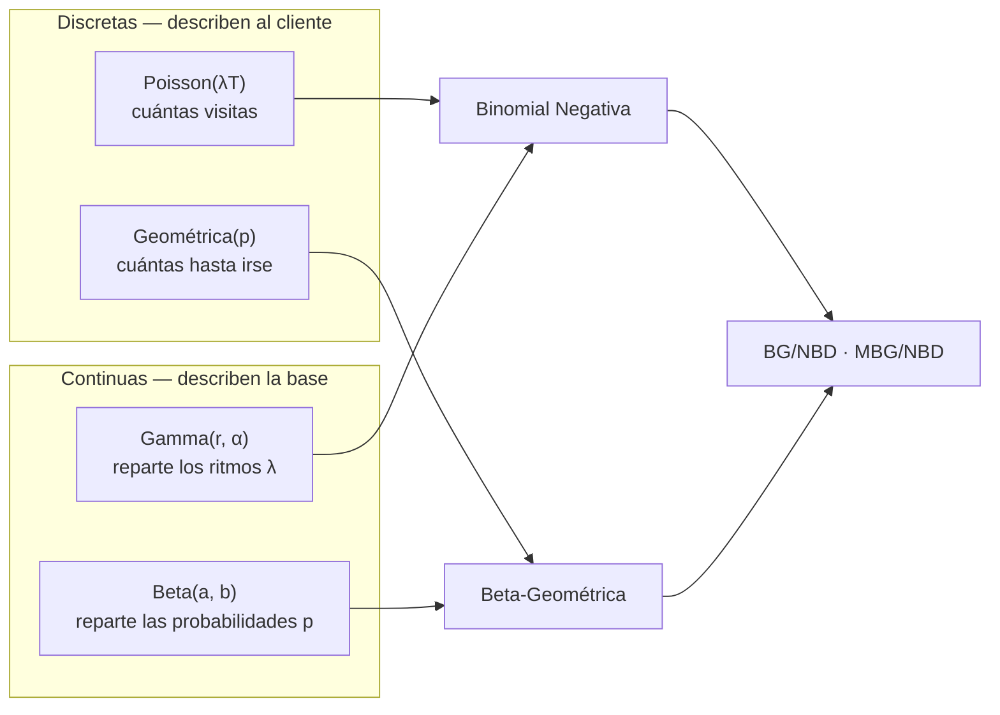

# Teoría: distribuciones base

> [!abstract] Idea central
> Cinco distribuciones y dos mezclas bastan para construir todos los modelos BTYD.
>
> Las **discretas** cuentan cosas: cuántas visitas hace un cliente, cuántas más hará antes de dejar de venir. Las **continuas** describen magnitudes que varían entre clientes: a qué ritmo compra cada uno, con qué probabilidad abandona.
>
> Mezclar una discreta con una continua produce los modelos que interesan.

Nota de fundamentos. Los ejemplos son de retail con cifras ilustrativas, no medidas sobre nuestra base — esas están en [[Descubrimientos - ecommerce metro]].

> [!info] Fuentes usadas para reforzar esta nota
> - Devore, J. — *Probabilidad y Estadística para Ingeniería y Ciencias* (7ª ed.), capítulos 3 (discretas) y 4 (continuas: exponencial, gamma, beta).
> - Blitzstein, J. & Hwang, J. — *Introduction to Probability* (2ª ed.), capítulos 3-5 (distribuciones y sus "historias") y 8 (Gamma, Beta y su conexión).
>
> Se citan puntualmente donde aportan una demostración, una definición más formal, o el "¿qué resuelve?" que motiva cada fórmula.

---

## 1 · El marco: el proceso de Poisson

Antes que las distribuciones está el proceso que las genera.

> [!note] Definición 1.1
> Un **proceso de Poisson de tasa $\lambda$** modela eventos en el tiempo bajo tres condiciones:
>
> 1. **Sin memoria** — lo que pasa en semanas distintas es independiente
> 2. **Tasa constante** — la probabilidad de una visita en un intervalo pequeño $h$ es aproximadamente $\lambda h$
> 3. **De uno en uno** — no hay dos visitas simultáneas
>
> **Donde:**
> - $\lambda$ — tasa de eventos por unidad de tiempo. Ejemplo: 2 visitas al mes
> - $h$ — intervalo de tiempo muy pequeño

> [!note]- Formalización rigurosa (Devore, cap. 3)
> La versión precisa de "tasa constante y sin memoria" usa tres supuestos sobre un parámetro $\alpha>0$:
>
> 1. En un intervalo corto $\Delta t$, la probabilidad de **exactamente un evento** es $\alpha\,\Delta t + o(\Delta t)$
> 2. La probabilidad de **más de un evento** en $\Delta t$ es $o(\Delta t)$
> 3. El número de eventos en $\Delta t$ es **independiente** de lo ocurrido antes de ese intervalo
>
> **Donde:**
> - $o(\Delta t)$ — se lee "o-pequeña de $\Delta t$": cualquier cantidad que, comparada con $\Delta t$, tiende a cero *más rápido* que $\Delta t$ cuando $\Delta t \to 0$ (formalmente, $o(\Delta t)/\Delta t \to 0$). Sirve para descartar sucesos "raros de orden superior" — como dos visitas en el mismo instante — sin tener que nombrarlos uno por uno.
>
> Sea $P_k(t)$ la probabilidad de observar exactamente $k$ eventos en un intervalo de duración $t$. Se puede demostrar (planteando cómo cambia $P_k$ al extender el intervalo en $\Delta t$, y llevando $\Delta t\to 0$) que estas $P_k(t)$ satisfacen un sistema de ecuaciones diferenciales cuya solución es:
> $$P_k(t) = \frac{e^{-\alpha t}(\alpha t)^{k}}{k!}$$
>
> Es exactamente la fórmula de Poisson de la Definición 2.1, con $\mu = \alpha t$. Es decir: **los tres supuestos informales de arriba, llevados al límite, obligan matemáticamente a que el conteo sea Poisson** — no es una elección arbitraria de fórmula.
>
> El mismo razonamiento no depende de que sea "tiempo": si en vez de un intervalo se usa un área o volumen $R$, el conteo de eventos en $R$ también sale Poisson con parámetro $\alpha \cdot a(R)$, donde $a(R)$ es el área. Por eso el proceso de Poisson también sirve para modelar, por ejemplo, tiendas distribuidas en un mapa por km².

Del proceso salen preguntas distintas, y cada una tiene su distribución:

| Pregunta sobre un cliente                | Distribución | Tipo     |
| ---------------------------------------- | ------------ | -------- |
| ¿Cuántas veces vino este mes?            | Poisson      | discreta |
| ¿Cuántas veces más vendrá antes de irse? | Geométrica   | discreta |
| ¿Cuántos días hasta su próxima visita?   | Exponencial  | continua |
| ¿Cuántos días hasta su quinta visita?    | Gamma        | continua |

> [!example] Ejemplo 1.2
> Una clienta que "va al súper unas 2 veces cada 30 días, sin día fijo" es un proceso de Poisson con $\lambda = 2/30$.
>
> No significa que vaya cada 15 días exactos. Significa que sus visitas se dispersan al azar con esa frecuencia media: puede ir dos veces la misma semana y luego faltar tres.

> [!warning] El supuesto que más cuesta en retail
> "Tasa constante" implica que el cliente compra al mismo ritmo toda su vida. En la práctica hay estacionalidad, mudanzas, cambios de trabajo.
>
> El modelo lo asume igual, y por eso no puede representar a un cliente que **antes venía cada semana y ahora viene cada dos meses**: para él solo existen dos estados, vivo al ritmo alto o muerto.

---

# Parte I · Distribuciones discretas

Toman valores contables: $0, 1, 2, \dots$ Describen **conteos**.

---

## 2 · Poisson

> [!abstract] ¿Qué resuelve?
> Responde "¿cuántas veces ocurre algo en un periodo fijo?", cuando los eventos son independientes y a ritmo constante — no hace falta que sea "tiempo": basta con muchos sucesos raros e independientes que se suman (el "paradigma de Poisson" de Blitzstein & Hwang, ver §2.3). Filosofía: un solo número $\mu$ concentra toda la información, y eso se ve en la fórmula misma: $\mu^{k}$ acumula la tasa por cada uno de los $k$ eventos, $k!$ descuenta el orden en que pudieron llegar (no importa cuál fue primero), y $e^{-\mu}$ es exactamente lo que hace falta para que las probabilidades sumen 1.

> [!note] Definición 2.1
> $$P(X = k) = \frac{e^{-\mu}\,\mu^{k}}{k!}$$
>
> **Donde:**
> - $X$ — variable aleatoria: número de eventos observados
> - $k$ — valor concreto que puede tomar $X$; recorre $0, 1, 2, \dots$
> - $\mu$ — número medio de eventos en el periodo. Único parámetro
> - $e$ — constante de Euler, $\approx 2.71828$
> - $k!$ — factorial de $k$
>
> Si el proceso tiene tasa $\lambda$ y se observa durante un tiempo $T$:
> $$\mu = \lambda\,T$$
>
> **Donde:**
> - $\lambda$ — tasa por unidad de tiempo (ej. visitas al mes)
> - $T$ — duración de la observación, en la misma unidad que $\lambda$

### 2.1 · La propiedad que la define

> [!important] Proposición 2.2 — equidispersión
> $$E[X] = \text{Var}(X) = \mu$$
>
> **Donde:**
> - $E[X]$ — esperanza (media) de $X$
> - $\text{Var}(X)$ — varianza de $X$: cuánto se dispersan los valores alrededor de la media
> - $\mu$ — el mismo parámetro de la Definición 2.1
>
> Media y varianza **coinciden**. Un solo parámetro fija a la vez el centro y la dispersión.

> [!note]- Demostración
> $$E[X] = \sum_{k=0}^{\infty} k\,\frac{e^{-\mu}\mu^{k}}{k!} = e^{-\mu}\mu\sum_{j=0}^{\infty}\frac{\mu^{j}}{j!} = e^{-\mu}\mu\,e^{\mu} = \mu$$
>
> El término $k=0$ se anula, y sustituyendo $j = k-1$ aparece la serie de $e^{\mu}$.
>
> Para la varianza se calcula primero el momento factorial:
> $$E[X(X-1)] = \sum_{k=0}^{\infty} k(k-1)\frac{e^{-\mu}\mu^{k}}{k!} = e^{-\mu}\mu^{2}\sum_{j=0}^{\infty}\frac{\mu^{j}}{j!} = \mu^{2}$$
> De donde $E[X^{2}] = E[X(X-1)] + E[X] = \mu^{2}+\mu$, y entonces
> $$\text{Var}(X) = E[X^{2}] - E[X]^{2} = \mu^{2}+\mu-\mu^{2} = \mu \qquad \blacksquare$$

> [!example] Ejemplo 2.3 — visitas mensuales
> Un cliente con $\lambda = 2$ visitas al mes, observado un mes ($T = 1$, luego $\mu = 2$):
>
> | visitas $k$ | 0 | 1 | 2 | 3 | 4 | 5 |
> |---|---|---|---|---|---|---|
> | $P(X=k)$ | 0.1353 | 0.2707 | 0.2707 | 0.1804 | 0.0902 | 0.0361 |
>
> Que **no venga ningún día** tiene probabilidad 0.135: uno de cada siete meses. Que venga 3 o más veces, la probabilidad baja desde 0.2707.

> [!danger] Por qué Poisson solo no sirve para una base de clientes
> El modelo dice que casi nadie viene 6 o más veces al mes. Pero en cualquier supermercado **existen** los clientes que van dos veces por semana.
>
> El problema no es el Poisson: es aplicar **el mismo $\mu$ a toda la base**. Si en tus datos la varianza supera a la media —**sobredispersión**— es señal de que estás mezclando clientes muy distintos.
>
> $$\text{índice de dispersión} = \frac{\text{Var}(X)}{E[X]}$$
>
> **Donde:**
> - $= 1$ — compatible con Poisson
> - $> 1$ — sobredispersión: la base es heterogénea
>
> En retail suele dar decenas.

### 2.2 · Aditividad

> [!important] Proposición 2.4
> $$X_1 + X_2 \sim \text{Poisson}(\mu_1+\mu_2)$$
>
> **Donde:**
> - $X_1 \sim \text{Poisson}(\mu_1)$ y $X_2 \sim \text{Poisson}(\mu_2)$ — conteos **independientes**, por ejemplo de dos meses consecutivos
> - $\sim$ — se lee "sigue la distribución"
>
> Por eso $\mu = \lambda T$ escala con el tiempo: si un cliente hace 2 visitas al mes, hace 24 al año.

> [!note]- Demostración (Blitzstein & Hwang, cap. 4)
> Se condiciona sobre $X_1$ y se usa la ley de probabilidad total para obtener la función masa de $X_1+X_2$ en $k$:
> $$P(X_1+X_2=k) = \sum_{j=0}^{k} P(X_1=j)\,P(X_2=k-j) = \sum_{j=0}^{k} \frac{e^{-\mu_1}\mu_1^{j}}{j!}\cdot\frac{e^{-\mu_2}\mu_2^{k-j}}{(k-j)!}$$
>
> Sacando factor común $e^{-(\mu_1+\mu_2)}$ y multiplicando y dividiendo por $k!$:
> $$P(X_1+X_2=k) = \frac{e^{-(\mu_1+\mu_2)}}{k!}\sum_{j=0}^{k} \binom{k}{j}\mu_1^{j}\mu_2^{k-j}$$
>
> La suma es exactamente el binomio de Newton $(\mu_1+\mu_2)^k$, así que
> $$P(X_1+X_2=k) = \frac{e^{-(\mu_1+\mu_2)}(\mu_1+\mu_2)^{k}}{k!} \qquad \blacksquare$$
>
> Es la función masa de $\text{Poisson}(\mu_1+\mu_2)$. Intuición: si dos tipos de eventos ocurren a tasas $\mu_1$ y $\mu_2$ independientes, la tasa combinada es $\mu_1+\mu_2$ — nada más natural.

### 2.3 · Poisson como límite (y aproximación) de la Binomial

> [!note] El paradigma de Poisson (Blitzstein & Hwang, cap. 4)
> Si tienes $n$ eventos posibles $A_1,\dots,A_n$, cada uno con probabilidad **pequeña** $p_j$, aproximadamente independientes entre sí, y $X$ cuenta cuántos de ellos ocurren:
> $$X = \sum_{j=1}^{n} \mathbb{1}(A_j) \quad \Longrightarrow \quad X \approx \text{Poisson}(\lambda), \qquad \lambda = \sum_{j=1}^{n} p_j$$
>
> **Donde:**
> - $\mathbb{1}(A_j)$ — indicador: vale 1 si el evento $A_j$ ocurre, 0 si no
> - "pequeña" no significa que $\lambda$ sea pequeño — significa que cada $p_j$ individual es pequeña, aunque haya muchos eventos
>
> Esto explica **por qué** tantas cosas distintas terminan siendo Poisson: no hace falta un "proceso en el tiempo" propiamente dicho, basta con muchos eventos raros e independientes que se suman. Ejemplos clásicos: correos que te llegan en una hora (muchas personas, cada una con probabilidad baja de escribirte justo esa hora), o clientes que reclaman un cupón el mismo día (muchos clientes, cada uno con probabilidad baja de hacerlo hoy).

> [!important] Proposición 2.5 — Poisson como límite de la Binomial
> Si $X\sim\text{Bin}(n,p)$ y se hace $n\to\infty$, $p\to 0$ de modo que $np\to\lambda$ (constante), entonces la función masa de $X$ converge a la de $\text{Poisson}(\lambda)$.
>
> **Regla empírica (Devore):** la aproximación $b(x;n,p)\approx p(x;\lambda=np)$ es razonable si $n>50$ y $np<5$.
>
> Es el mismo paradigma de arriba en su versión más simple: $n$ ensayos independientes, cada uno con la misma probabilidad pequeña $p$ de "éxito", y $X$ cuenta los éxitos totales.

> [!example] Ejemplo 2.6 — aproximando una campaña de cupones
> Una tienda envía un cupón a $n=2000$ clientes. Cada cliente, independientemente, tiene probabilidad $p=0.0015$ de reclamarlo el mismo día (estimado de campañas anteriores). ¿Cuál es la probabilidad de que **exactamente 5** clientes lo reclamen hoy?
>
> **Paso 1 — verificar que aplica la aproximación.** $n=2000>50$ y $np = 2000\times0.0015=3<5$. Aplica.
>
> **Paso 2 — calcular $\lambda$.**
> $$\lambda = np = 3$$
>
> **Paso 3 — aplicar Poisson en vez de Binomial.**
> $$P(X=5) \approx \frac{e^{-3}\,3^{5}}{5!} = \frac{0.0498 \times 243}{120} \approx 0.1008$$
>
> **Paso 4 — verificar contra el valor binomial exacto.** El valor exacto con la fórmula binomial es $0.10084$ — la aproximación acierta hasta el cuarto decimal. Calcular esto directamente con la fórmula binomial exacta habría exigido combinatoria con números de 2000 factorial; Poisson lo resuelve con tres multiplicaciones.

---

## 3 · Geométrica

> [!abstract] ¿Qué resuelve?
> Responde la pregunta "¿cuántas veces más se repite algo antes de que ocurra un evento que lo detiene?". Mide un número de intentos: por ejemplo, en un problema de **abandono** de clientes, mide cuántas veces más vuelve a comprar un cliente antes de dejar de hacerlo.
>
> En la fórmula, $(1-p)^{k}$ es la probabilidad de fallar $k$ veces seguidas (por independencia, las probabilidades se multiplican) y el $p$ final es la probabilidad de que el éxito ocurra justo después de esas $k$ fallas.
>
> **Filosofía:** la probabilidad de abandono es la misma en cada compra, sin importar cuántas compras ya lleva el cliente. No hay un "desgaste" progresivo ya que cada día de compra es independiente, es decir que el cliente no se cansa ni acumula fatiga que vaya subiendo su riesgo de irse con cada compra adicional, la probabilidad de abandonar en la compra número 50 es idéntica a la de la primera. Esta propiedad se llama **falta de memoria**, y no es una elección arbitraria de la fórmula: Blitzstein & Hwang demuestran (Teorema 5.5.3, versión discreta) que la falta de memoria **obliga** matemáticamente a esta forma exacta, y a ninguna otra — no existe otra distribución sobre $0,1,2,\dots$ que la cumpla.

> [!note] Definición 3.1
> $$P(X = k) = (1-p)^{k}\,p$$
>
> **Donde:**
> - $X$ — número de **fracasos antes del primer éxito**; recorre $0, 1, 2, \dots$
> - $k$ — valor concreto de $X$
> - $p$ — probabilidad de éxito en cada ensayo, $0 < p < 1$. Único parámetro
> - $(1-p)^{k}$ — probabilidad de fallar $k$ veces seguidas
>
> En retail el "éxito" es el abandono: tras cada compra el cliente decide si vuelve. Así $X$ es el número de **recompras** que llega a hacer.

> [!important] Proposición 3.2 — momentos
> $$E[X] = \frac{1-p}{p}, \qquad \text{Var}(X) = \frac{1-p}{p^{2}}$$
>
> **Donde:**
> - $E[X]$ — recompras esperadas antes de abandonar
> - $p$ — probabilidad de abandono tras cada compra
>
> Cuanto menor es $p$, más recompras y más dispersión.

> [!warning] Dos convenciones
> Algunos textos cuentan el **número de ensayos** hasta el éxito:
> $$P(Y = k) = (1-p)^{k-1}p, \qquad k = 1, 2, 3, \dots, \qquad E[Y] = \frac{1}{p}$$
>
> **Donde:**
> - $Y = X + 1$ — incluye el ensayo exitoso
>
> BTYD usa la primera convención ($X$, fracasos previos), porque así el conteo coincide con las recompras.

> [!example] Ejemplo 3.3 — cuántas veces vuelve
> Nos ponemos en el caso hipotético de 1 cliente de cada 3 clientes puede que no vuelva, entonces nuestro $p$ del abandono sería $p=1/3$, así modelamos la distribución:
>
> | recompras $k$ | 0 | 1 | 2 | 3 | 4 |
> |---|---|---|---|---|---|
> | $P(X=k)$ | 0.3333 | 0.2222 | 0.1481 | 0.0988 | 0.0658 |
>
> $E[X] = \frac{1-1/3}{1/3} = 2$ recompras en promedio. Pero fíjate: **el valor más probable es 0**. Un tercio de los clientes con este perfil compra una sola vez y desaparece.
>
> La geométrica es siempre decreciente, así que el pico en cero no es una anomalía de los datos: es lo que el modelo predice.

> [!important] Proposición 3.4 — falta de memoria
> $$P(X \geq s+t \mid X \geq s) = P(X \geq t)$$
>
> **Donde:**
> - $s$ — ensayos ya superados
> - $t$ — ensayos adicionales
> - $\mid$ — "dado que", condicionamiento
>
> Que un cliente ya haya vuelto 10 veces no cambia lo que le queda por delante. La geométrica es **el análogo discreto de la exponencial** (§4).

---

# Parte II · Distribuciones continuas

Toman valores en un intervalo real. En BTYD no describen conteos, sino **cómo se reparte entre clientes** algo que no se observa directamente.

---

## 4 · Exponencial

> [!abstract] ¿Qué resuelve?
> Responde "¿cuánto falta para el próximo evento?" — la misma pregunta de la Geométrica, pero en tiempo continuo en vez de conteos. La demostración de abajo muestra de dónde sale cada símbolo: $e^{-\lambda w}$ es la probabilidad de que el conteo de Poisson en $[0,w]$ siga en cero, y $\lambda$ aparece al derivar esa cola para obtener la densidad. Filosofía (Blitzstein & Hwang, Teorema 5.5.3): la falta de memoria no es una curiosidad añadida — es la ecuación funcional $P(W>s+t\mid W>s)=P(W>t)$ la que **obliga** a que la solución tenga forma exponencial; ninguna otra distribución continua en $(0,\infty)$ la cumple.

> [!important] Proposición 4.1
> $$f(w) = \lambda\,e^{-\lambda w}, \qquad w > 0$$
>
> **Donde:**
> - $W$ — tiempo hasta el siguiente evento (variable aleatoria continua)
> - $w$ — valor concreto de $W$, en unidades de tiempo
> - $f(w)$ — **densidad**, no probabilidad. En variables continuas $P(W = w) = 0$; lo que tiene sentido es $P(a < W < b) = \int_a^b f(w)\,dw$
> - $\lambda$ — la misma tasa del proceso de Poisson
>
> Y su media:
> $$E[W] = \frac{1}{\lambda}$$

> [!note]- Demostración
> "No hay visitas antes de $w$" equivale a "el conteo en $[0,w]$ es cero", y ese conteo es Poisson de media $\lambda w$:
> $$P(W > w) = P(X_{[0,w]} = 0) = \frac{e^{-\lambda w}(\lambda w)^{0}}{0!} = e^{-\lambda w}$$
> Luego la función de distribución es $F(w) = 1-e^{-\lambda w}$ y, derivando,
> $$f(w) = \frac{dF}{dw} = \lambda e^{-\lambda w} \qquad \blacksquare$$

Es la misma información leída al revés: **tasa alta ⟺ esperas cortas**. Un cliente de 24 visitas al año ($\lambda = 24$/año) espera $1/24$ de año, unos 15 días.

> [!danger] Proposición 4.2 — falta de memoria
> $$P(W > s+t \mid W > s) = P(W > t)$$
>
> **Donde:**
> - $s$ — tiempo ya transcurrido sin evento
> - $t$ — tiempo adicional
>
> Si un cliente que viene cada 15 días lleva 45 sin aparecer, **su espera restante sigue siendo 15 días en promedio**. El tiempo transcurrido no lo acerca ni lo aleja de volver.
>
> Consecuencia incómoda: con $\lambda$ conocida y fija, **el silencio no es evidencia de nada**. Un modelo Poisson puro nunca concluye que un cliente se fue.
>
> Para que el silencio signifique algo hacen falta dos cosas: incertidumbre sobre $\lambda$ (§6) o un proceso de abandono explícito → [[BG-NBD y Pareto-NBD]].

---

## 5 · Gamma

> [!abstract] ¿Qué resuelve?
> Responde "¿cómo se reparten los ritmos $\lambda$ entre clientes distintos?" — no describe a un cliente, describe a **toda la base**. Su forma no es arbitraria: Devore y Blitzstein & Hwang la derivan como la suma de $r$ tiempos Exponenciales independientes (el tiempo hasta el $r$-ésimo evento de un proceso de Poisson), y esa suma es justo lo que produce $\lambda^{r-1}e^{-\alpha\lambda}$ al convolucionar las $r$ densidades — con $\Gamma(r)$ como el factorial generalizado que normaliza. Filosofía: al dejar que $r$ sea cualquier número real y no solo un conteo de eventos, la misma fórmula deja de contar "hasta el $r$-ésimo evento" y pasa a describir qué tan parecidos o dispares son los ritmos de compra de la base — es el mismo objeto matemático, leído con otro propósito.

> [!note] Definición 5.1
> $$f(\lambda) = \frac{\alpha^{r}}{\Gamma(r)}\,\lambda^{r-1}e^{-\alpha\lambda}, \qquad \lambda > 0$$
>
> **Donde:**
> - $\lambda$ — aquí es la **variable**, no un parámetro: el ritmo de compra de un cliente cualquiera
> - $r$ — parámetro de **forma**, $r > 0$. Controla la asimetría
> - $\alpha$ — parámetro de **tasa**, $\alpha > 0$. Controla la escala
> - $\Gamma(r)$ — función Gamma, $\Gamma(r) = \int_{0}^{\infty}u^{r-1}e^{-u}\,du$. Normaliza para que la densidad integre 1. Extiende el factorial: $\Gamma(n) = (n-1)!$ para $n$ entero
>
> Se escribe $\lambda \sim \text{Gamma}(r, \alpha)$.

> [!important] Proposición 5.2 — momentos
> $$E[\lambda] = \frac{r}{\alpha}, \qquad \text{Var}(\lambda) = \frac{r}{\alpha^{2}}, \qquad \text{Moda} = \frac{r-1}{\alpha}\ \ (r\geq 1)$$
>
> **Donde:**
> - $E[\lambda]$ — ritmo medio de la base
> - $\text{Var}(\lambda)$ — cuánto difieren los clientes entre sí
> - Moda — el ritmo más frecuente. Solo existe como pico interior si $r \geq 1$

> [!warning] Cuidado con la parametrización
> Hay dos convenciones:
> $$\alpha \ (\text{tasa}) \qquad\Longleftrightarrow\qquad \theta = \frac{1}{\alpha} \ (\text{escala})$$
>
> En `scipy.stats.gamma` el argumento es `scale`, así que $\text{Gamma}(r,\alpha)$ se construye como `gamma(a=r, scale=1/alpha)`. Confundirlas invierte la interpretación de $\alpha$.

### 5.1 · Los dos papeles de $r$

**Como tiempo de espera.** Si $r$ es entero, $\text{Gamma}(r,\alpha)$ es el tiempo hasta la $r$-ésima visita. Con $r=1$ se recupera la exponencial.

**Como distribución de tasas.** El uso que interesa: describir cómo se reparten los ritmos de compra entre los clientes. Entonces $r$ controla **la forma**.

> [!important] La forma según $r$
> | $r$ | Densidad | Base de clientes |
> |---|---|---|
> | $r > 1$ | campana asimétrica | ritmos parecidos entre sí |
> | $r = 1$ | exponencial | — |
> | $r < 1$ | **"L"**: pico en 0, cola larga | muy dispar |
>
> **Cuanto menor es $r$, mayor la heterogeneidad.**

> [!example] Ejemplo 5.3 — la base de un supermercado
> Supón una base cuyo promedio es **24 visitas al año** con $r = 0.5$. Despejando de $E[\lambda] = r/\alpha$:
> $$\alpha = \frac{r}{E[\lambda]} = \frac{0.5}{24} = 0.0208 \ \text{por año} \quad\longleftrightarrow\quad \alpha = 7.6 \ \text{días}
> $$
>
> | percentil | visitas/año | equivale a |
> |---|---|---|
> | 25 | 2.44 | 1 cada 5 meses |
> | **50** | **10.92** | **1 cada 5 semanas** |
> | 75 | 31.76 | 2-3 al mes |
> | 90 | 64.93 | más de 1 por semana |
> | 99 | 159.24 | 3 por semana |
>
> - $P(\lambda < 2 \text{ al año}) = 22.7\%$
> - $P(\lambda > 52 \text{ al año}) = 14.1\%$

> [!success] Lo que hay que leer en esa tabla
> La media es 24 visitas al año, pero **la mediana es 10.9**: menos de la mitad.
>
> El "cliente promedio de 2 visitas al mes" **no existe**. Hay un 23% que casi no aparece y un 14% que va semanalmente, y el promedio cae en un hueco donde hay poca gente.
>
> Esto no es un defecto de los datos: es lo que ocurre siempre que $r < 1$. Y es la razón por la que segmentar por "frecuencia promedio" da resultados pobres.

### 5.2 · Por qué la Gamma

1. **Soporte positivo** — una tasa de visita no puede ser negativa
2. **Flexibilidad** — con dos parámetros va de "todos parecidos" a "extremadamente dispar"
3. **Conjugación** con el Poisson → §6

---

## 6 · Interludio · Estadística bayesiana

Hasta aquí las distribuciones se han usado para *describir*. Ahora se usan para *aprender de un cliente concreto*, y para eso hace falta la idea bayesiana.

### 6.1 · El problema

Un cliente entró hace 30 días y vino 3 veces. ¿A qué ritmo compra?

La respuesta directa es $3/30 = 0.1$ al día, o **36.5 al año**. Pero eso es frágil: con 30 días de historia, tres visitas pueden ser casualidad. Si hubiera venido 4 veces dirías 48.7 al año; si 2, dirías 24.3.

Y el problema empeora en el extremo: un cliente que entró **ayer** y compró una vez daría una tasa de 365 visitas al año.

### 6.2 · La idea

> [!important] Teorema de Bayes (forma proporcional)
> $$\underbrace{f(\lambda \mid \text{datos})}_{\text{posterior}} \;\propto\; \underbrace{P(\text{datos} \mid \lambda)}_{\text{verosimilitud}} \times \underbrace{f(\lambda)}_{\text{prior}}$$
>
> **Donde:**
> - **Prior** $f(\lambda)$ — lo que crees *antes* de mirar a este cliente. Aquí: la distribución de ritmos de toda la base (§5)
> - **Verosimilitud** $P(\text{datos} \mid \lambda)$ — probabilidad de observar lo que observaste *si* el ritmo fuera $\lambda$. Aquí: sus 3 visitas en 30 días
> - **Posterior** $f(\lambda \mid \text{datos})$ — lo que crees *después* de combinar ambos
> - $\propto$ — "proporcional a". Se omite la constante que hace que el posterior integre 1

La lógica es la de cualquier juicio razonable: **cuando tienes poca información sobre alguien, lo juzgas parecido al resto; cuando tienes mucha, lo juzgas por lo suyo.** El teorema de Bayes solo pone aritmética a eso.

### 6.3 · Conjugación

Combinar prior y verosimilitud suele exigir integrales feas. Pero para ciertas parejas el resultado se queda **en la misma familia** del prior, y la actualización se vuelve una suma.

> [!important] Proposición 6.1 — Gamma-Poisson
> $$\lambda \mid x, T \;\sim\; \text{Gamma}(r+x,\ \alpha+T)$$
>
> **Donde:**
> - $r, \alpha$ — parámetros del prior
> - $x$ — eventos observados en este cliente
> - $T$ — tiempo durante el que se observó
>
> Los datos **se suman** a los parámetros del prior.

> [!note]- Demostración
> $$f(\lambda \mid x) \;\propto\; \underbrace{e^{-\lambda T}(\lambda T)^{x}}_{\text{Poisson}}\cdot\underbrace{\lambda^{r-1}e^{-\alpha\lambda}}_{\text{Gamma}} \;\propto\; \lambda^{(r+x)-1}\,e^{-(\alpha+T)\lambda}$$
> Se descarta todo lo que no depende de $\lambda$ (constantes $T^x$, $x!$, $\alpha^r/\Gamma(r)$). La expresión final es el núcleo de una $\text{Gamma}(r+x,\ \alpha+T)$. $\blacksquare$

> [!important] Proposición 6.2 — Beta-binomial
> $$p \mid k, n \;\sim\; \text{Beta}(a+k,\ b+n-k)$$
>
> **Donde:**
> - $a, b$ — parámetros del prior
> - $k$ — éxitos observados
> - $n$ — ensayos totales; $n-k$ son los fracasos
>
> Se suman los éxitos a $a$ y los fracasos a $b$.

De ahí la lectura clave: **los parámetros del prior son datos imaginarios**. En $\text{Gamma}(r,\alpha)$, $r$ son visitas ficticias y $\alpha$ tiempo ficticio, que aporta la población antes de ver nada de este cliente.

### 6.4 · Encogimiento

> [!important] Media posterior
> $$E[\lambda \mid x, T] = \frac{r+x}{\alpha+T}$$
>
> **Donde:**
> - $r + x$ — visitas imaginarias más visitas reales
> - $\alpha + T$ — tiempo imaginario más tiempo real
>
> Si $T \ll \alpha$ el prior domina; si $T \gg \alpha$ dominan los datos.

> [!example] Ejemplo 6.3 — tres clientes de Metro
> Prior: $\text{Gamma}(r = 0.5,\ \alpha = 7.6\text{ días})$, una base con media de 24 visitas al año.
>
> | Cliente | $x$ | $T$ | Tasa cruda $x/T$ | **Posterior** |
> |---|---|---|---|---|
> | nuevo | 3 | 30 días | 36.5/año | **34.0/año** |
> | con un año | 30 | 365 días | 30.0/año | **29.9/año** |
> | inactivo | 1 | 365 días | 1.0/año | **1.5/año** |

> [!success] Qué está pasando
> El cliente **nuevo** tiene su tasa cruda (36.5) empujada hacia la media de la base (24). Con solo 30 días de historia el prior todavía pesa: el resultado, 34.0, es más conservador.
>
> El cliente **con un año** casi no se mueve: 30.0 → 29.9. Ya tiene datos suficientes para hablar por sí mismo.
>
> El cliente **inactivo** se mueve al alza: 1.0 → 1.5. El prior le concede el beneficio de la duda, aunque poco.
>
> A esto se le llama **encogimiento** (*shrinkage*). La transición es automática: no hay que decidir cuántos datos hacen falta para "confiar" en un cliente.

> [!important] Aquí sí importa el silencio
> En §4 vimos que con $\lambda$ conocida el silencio no informa. Con $\lambda$ **desconocida** sí: cada día sin comprar aumenta $T$ sin aumentar $x$, y la tasa estimada $\frac{r+x}{\alpha+T}$ baja.
>
> Ese es el mecanismo. Y también su límite: **baja la tasa, pero nunca concluye que el cliente se fue.**

---

## 7 · Beta

> [!abstract] ¿Qué resuelve?
> Igual que la Gamma reparte ritmos entre 0 e infinito, la Beta reparte **probabilidades** entre 0 y 1: "¿qué tan disperso es el riesgo de abandono en la base?". Devore señala que es la única distribución continua de esta nota con soporte en un intervalo finito — por eso es la elegida para algo que, por definición, nunca puede salir de $[0,1]$. En la fórmula, $p^{a-1}(1-p)^{b-1}$ tiene exactamente la forma de una verosimilitud binomial ($a-1$ "éxitos" y $b-1$ "fracasos" imaginarios) y $B(a,b)$ solo normaliza — no es casualidad: es justo lo que la hace la conjugada natural del abandono (§6.3, §7.2). Filosofía (Blitzstein & Hwang): sirve para poner una probabilidad **sobre una probabilidad que no conoces**.

> [!note] Definición 7.1
> $$f(p) = \frac{p^{a-1}(1-p)^{b-1}}{B(a,b)}, \qquad 0 < p < 1$$
>
> **Donde:**
> - $p$ — aquí es la **variable**: la probabilidad de abandono de un cliente cualquiera
> - $a$ — parámetro de forma, $a > 0$. Empuja hacia valores altos de $p$
> - $b$ — parámetro de forma, $b > 0$. Empuja hacia valores bajos de $p$
> - $B(a,b)$ — función Beta, $B(a,b) = \dfrac{\Gamma(a)\Gamma(b)}{\Gamma(a+b)}$. Normaliza para que integre 1
>
> Se escribe $p \sim \text{Beta}(a,b)$.

> [!important] Proposición 7.2 — momentos
> $$E[p] = \frac{a}{a+b}, \qquad \text{Var}(p) = \frac{ab}{(a+b)^{2}(a+b+1)}, \qquad \text{Moda} = \frac{a-1}{a+b-2}\ \ (a,b>1)$$
>
> **Donde:**
> - $E[p]$ — probabilidad media de abandono en la base
> - $a+b$ — mide la **concentración**: aparece en el denominador de la varianza, así que a mayor suma, más estrecha la densidad

### 7.1 · Cómo leer $a$ y $b$

Por la conjugación de §6.3, $a$ y $b$ se leen como **éxitos y fracasos imaginarios**.

> [!important] La forma según $a$ y $b$
> | Caso | Densidad | Base de clientes |
> |---|---|---|
> | $a = b = 1$ | uniforme | sin información |
> | $a, b > 1$ | unimodal | fidelidad parecida |
> | $a, b < 1$ | **"U"** | polarizada: o muy fieles o de una sola compra |
> | $a < 1 < b$ | **"J" decreciente** | mayoría fiel, minoría volátil |
> | $a > 1 > b$ | **"J" creciente** | mayoría volátil |
>
> Igual que con la Gamma, con formas "U" o "J" **la media no representa a nadie**.

> [!example] Ejemplo 7.3 — probabilidad de no volver
> Dos bases con la **misma media** ($E[p] = 0.10$) pero distinta dispersión:
>
> | percentil | $\text{Beta}(1,9)$ | $\text{Beta}(2,18)$ |
> |---|---|---|
> | 10 | 0.012 | 0.028 |
> | 25 | 0.032 | 0.051 |
> | 50 | 0.074 | 0.087 |
> | 75 | 0.143 | 0.136 |
> | 90 | **0.226** | **0.190** |
> | desv. típica | 0.091 | 0.066 |
>
> Comprobación con la fórmula: $\frac{1}{1+9} = \frac{2}{2+18} = 0.10$ en ambos casos.
>
> $\text{Beta}(1,9)$ tiene más clientes en los extremos. $\text{Beta}(2,18)$, con el doble de evidencia imaginaria ($a+b = 20$ frente a $10$), está más concentrada.

> [!note] La misma media, decisiones distintas
> Si se acciona sobre "los clientes con más riesgo", en la primera base ese grupo es mucho más extremo. La media no basta para diseñar la campaña.

### 7.2 · Conjugación en acción

> [!example] Ejemplo 7.4 — tasa de canje de un cupón
> Prior $\text{Beta}(2,18)$: la experiencia dice que se canjea alrededor del 10%.
>
> Aplicando $\text{Beta}(a+k,\ b+n-k)$:
>
> | Observado $k/n$ | Posterior | $E[p]$ | Tasa cruda |
> |---|---|---|---|
> | 3 de 10 | $\text{Beta}(5,25)$ | **0.167** | 0.300 |
> | 30 de 100 | $\text{Beta}(32,88)$ | **0.267** | 0.300 |
> | 0 de 5 | $\text{Beta}(2,23)$ | **0.080** | 0.000 |
>
> Con 10 envíos, el 30% observado se modera hasta 0.167: la muestra es chica. Con 100 envíos el mismo 30% ya arrastra la estimación hasta 0.267.
>
> Y 0 canjes de 5 no lleva la estimación a cero —lo que sería absurdo— sino a 0.080.

---

# Parte III · Mezclas

Aquí se juntan las dos partes. El patrón es siempre el mismo: **una discreta describe al cliente, una continua describe la base, y se integra sobre la continua.**

$$P(X = k) = \int P(X = k \mid \theta)\,f(\theta)\,d\theta$$

**Donde:**
- $P(X = k \mid \theta)$ — la discreta, con el parámetro del cliente
- $f(\theta)$ — la continua, que reparte ese parámetro en la base
- $\theta$ — el parámetro no observado ($\lambda$ o $p$ según el caso)
- La integral promedia sobre todos los clientes posibles

---

## 8 · Gamma-Poisson

> [!abstract] ¿Qué resuelve?
> Responde "¿cuántas visitas hará un cliente cualquiera de la base, sin saber su $\lambda$?" — promediando Poisson sobre todos los ritmos posibles que reparte la Gamma. Filosofía: es la Poisson honesta cuando la base es heterogénea, en vez de fingir que todos comparten un solo $\mu$.

Ya vimos el posterior en §6.4. Falta la **marginal**: la distribución de conteos de un cliente elegido al azar, sin saber su $\lambda$.

> [!important] Proposición 8.1
> Si $X \mid \lambda \sim \text{Poisson}(\lambda T)$ y $\lambda \sim \text{Gamma}(r,\alpha)$, entonces $X$ sigue una **binomial negativa**:
> $$P(X = x) = \frac{\Gamma(r+x)}{\Gamma(r)\,x!}\left(\frac{\alpha}{\alpha+T}\right)^{r}\left(\frac{T}{\alpha+T}\right)^{x}$$
>
> **Donde:**
> - $x$ — número de eventos observados
> - $r, \alpha$ — parámetros de la Gamma que reparte los ritmos
> - $T$ — tiempo de observación de ese cliente
> - $\dfrac{\alpha}{\alpha+T}$ — el parámetro $p$ de la binomial negativa. **Depende de $T$**, así que hay uno por cliente

Se desarrolla en [[NBD - Poisson, Gamma y Binomial Negativa]]. La consecuencia práctica: la mezcla produce **más clientes de cero visitas y más clientes de muchas visitas** de los que un Poisson admite. Exactamente la forma que tienen los datos de retail.

---

## 9 · Beta-Geométrica

> [!abstract] ¿Qué resuelve?
> La misma pregunta aplicada al abandono: "¿cuántas recompras hará un cliente cualquiera, sin saber su $p$?" — promediando la Geométrica sobre la Beta. Filosofía: el mismo principio de Gamma-Poisson, ahora sobre la probabilidad de irse en vez del ritmo de volver.

Mismo patrón con la otra pareja.

> [!important] Proposición 9.1
> $$P(X = k) = \frac{B(a+1,\ b+k)}{B(a,b)}$$
>
> **Donde:**
> - $X \mid p \sim \text{Geométrica}(p)$ — recompras antes de abandonar
> - $p \sim \text{Beta}(a,b)$ — reparto de la probabilidad de abandono
> - $k$ — número de recompras
> - $B(\cdot,\cdot)$ — función Beta de la Definición 7.1

> [!note]- Demostración
> $$P(X=k) = E_p\!\left[(1-p)^{k}p\right] = \int_{0}^{1}(1-p)^{k}p\,\frac{p^{a-1}(1-p)^{b-1}}{B(a,b)}\,dp$$
> Agrupando exponentes, el integrando es $p^{a}(1-p)^{b+k-1}$, cuya integral en $[0,1]$ es $B(a+1,\ b+k)$ por definición de la función Beta. $\blacksquare$

> [!important] Proposición 9.2 — media
> $$E[X] = \frac{a+b-1}{a-1} - 1 \qquad \text{si } a > 1$$
>
> **Donde:**
> - $a, b$ — parámetros de la Beta
> - La condición $a > 1$ es esencial: para $a \leq 1$ **la media es infinita**, porque la cola es tan pesada que la serie no converge

> [!example] Ejemplo 9.3 — el coste de ignorar la heterogeneidad
> Una base con $\text{Beta}(2,3)$, es decir $E[p] = \frac{2}{5} = 0.4$. Se compara con suponer que **todos** los clientes tienen ese 0.4:
>
> | recompras $k$ | 0 | 1 | 2 | 3 | 4 | 5 |
> |---|---|---|---|---|---|---|
> | Beta-Geométrica | 0.4000 | 0.2000 | 0.1143 | 0.0714 | 0.0476 | 0.0333 |
> | Geométrica $p=0.4$ | 0.4000 | 0.2400 | 0.1440 | 0.0864 | 0.0518 | 0.0311 |
>
> Coinciden en 0 y divergen después. Aplicando la Proposición 9.2:
> $$E[X] = \frac{2+3-1}{2-1} - 1 = 3.0 \quad\text{frente a}\quad \frac{1-0.4}{0.4} = 1.5$$
>
> **El doble de error.**

> [!success] El mismo fenómeno que la sobredispersión
> Mezclar sobre una base heterogénea siempre engorda la cola, tanto en conteos (Gamma-Poisson) como en abandonos (Beta-Geométrica).
>
> La razón es la misma: los clientes de $p$ bajo sobreviven muchas rondas y dominan la cola aunque sean pocos. Usar el promedio los borra.

Esta mezcla es el proceso de abandono de BG/NBD y MBG/NBD → [[BG-NBD y Pareto-NBD]].

---

## 10 · Cómo encajan

| | Cliente | Base | Mezcla |
|---|---|---|---|
| **Comprar** | Poisson($\lambda T$) | Gamma($r,\alpha$) | Binomial Negativa |
| **Abandonar** | Geométrica($p$) | Beta($a,b$) | Beta-Geométrica |

Los cuatro parámetros de BG/NBD y MBG/NBD son exactamente $r, \alpha, a, b$: dos por cada proceso.

---

## Glosario de símbolos

| Símbolo | Significado | Dónde aparece |
|---|---|---|
| $X$ | variable aleatoria discreta (conteo) | §2, §3 |
| $k$, $x$ | valor concreto que toma $X$ | todas |
| $\lambda$ | ritmo de compra de un cliente | §1, §4, §5 |
| $\mu = \lambda T$ | visitas esperadas en un tiempo $T$ | §2 |
| $T$ | tiempo de observación del cliente | §2, §6, §8 |
| $W$ | tiempo hasta el siguiente evento | §4 |
| $p$ | probabilidad de no volver tras cada compra | §3, §7 |
| $r$ | forma de la Gamma; **menor $r$ = base más dispar** | §5 |
| $\alpha$ | tasa de la Gamma; $1/\alpha$ es la escala | §5 |
| $a$, $b$ | forma de la Beta; $a$ sube $p$, $b$ lo baja | §7 |
| $\Gamma(\cdot)$ | función Gamma; extiende el factorial | §5 |
| $B(\cdot,\cdot)$ | función Beta; normaliza la densidad | §7 |
| $E[\cdot]$ | esperanza (media) | todas |
| $\text{Var}(\cdot)$ | varianza | todas |
| $f(\cdot)$ | densidad de una variable continua | §4, §5, §7 |
| $\mid$ | "dado que" (condicionamiento) | §3, §6 |
| $\sim$ | "sigue la distribución" | todas |
| $\propto$ | "proporcional a" | §6 |

---

## Resumen

| Idea | |
|---|---|
| 1 | Poisson cuenta visitas; Geométrica cuenta recompras hasta el abandono |
| 2 | Poisson impone $\text{Var} = E$; en retail el cociente da decenas |
| 3 | Geométrica y Exponencial no tienen memoria: análogas, discreta y continua |
| 4 | Gamma reparte ritmos ($0$ a $\infty$); Beta reparte probabilidades ($0$ a $1$) |
| 5 | Con $r<1$ la mediana queda muy por debajo de la media: el cliente promedio no existe |
| 6 | Bayes combina lo que sabes de la base con lo que sabes del cliente |
| 7 | Las conjugadas actualizan sumando: $\text{Gamma}(r+x,\alpha+T)$, $\text{Beta}(a+k,b+n-k)$ |
| 8 | Encogimiento: poca historia → juzgado como la base; mucha → juzgado por lo suyo |
| 9 | Mezclar siempre engorda la cola |
| 10 | Con $\lambda$ incierta el silencio baja la tasa, pero nunca prueba el abandono |

**Enlaces:** [[NBD - Poisson, Gamma y Binomial Negativa]] · [[BG-NBD y Pareto-NBD]] · [[Descubrimientos - ecommerce metro]]

**enviar forecast de diciembre el viernes a la 1 pm**

carlos: hablar con carlos sobre la situación de las tablas.